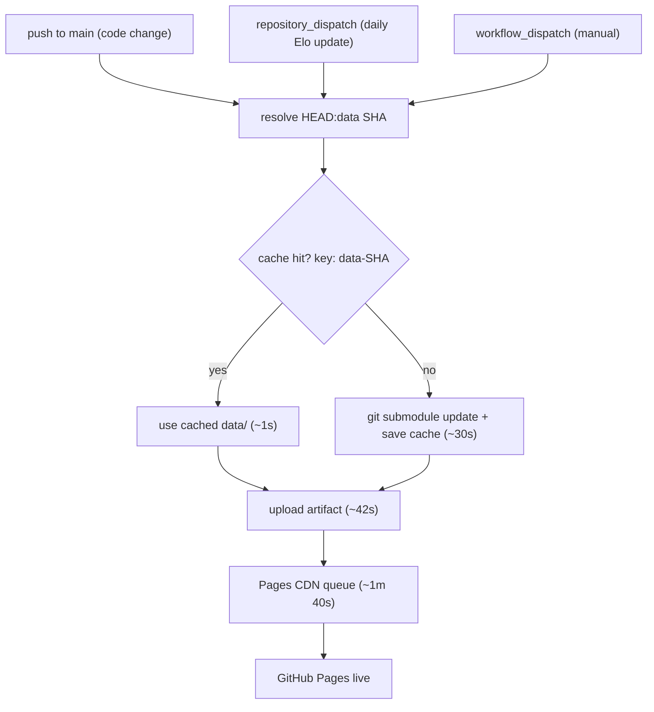

# mundial

Static frontend for the [Born In, Plays For](https://github.com/born-in-plays-for) project — interactive D3.js choropleth map of the 2026 FIFA World Cup showing where players were born vs. which country they represent.

**Live at [mundial.cthiebaud.com](https://mundial.cthiebaud.com/)**

## Pages

| URL | Description |
|---|---|
| [/](https://mundial.cthiebaud.com/) | Entry point — redirects to the map |
| [/wc2026_map.html](https://mundial.cthiebaud.com/wc2026_map.html) | Main choropleth map (countries + tournament + players, all in one page) |
| [/wc2026_live.html](https://mundial.cthiebaud.com/wc2026_live.html) | Live game tracking (requires backend) |
| [/chains/wc2026_chain_longest.html](https://mundial.cthiebaud.com/chains/wc2026_chain_longest.html) | Export chain snake renderer |

A handful of standalone pages that predated `wc2026_map.html` absorbing their functionality
(countries/players reference tables, a France departments choropleth, an elimination-status chart,
a talent-intensity heatmap, a country-taxonomy explainer) have been retired. They may return later
under `insights/`, rebuilt against the current codebase.

## Running locally

```bash
python3 -m http.server 8000
# open http://localhost:8000/
```

The map uses `fetch()` and requires an HTTP server — `file://` will not work.

After cloning, initialise the data submodule:

```bash
git submodule update --init
```

**Tip:** Configure git to automatically update submodules on pull:
```bash
git config submodule.recurse true
```
This eliminates the need to manually run `git submodule update` after each pull.

## Data

All data files live in the `data/` directory, which is a git submodule pointing to [mundial-data](https://github.com/born-in-plays-for/mundial-data). The submodule holds only the pid-keyed `v2/` files consumed by the frontend, plus two top-level files — nothing pipeline-internal is published here anymore (see below):

| File | Contents |
|---|---|
| `v2/map.json` | Player export/import data, populations, capitals, native players (pid-keyed) |
| `v2/live.json` | Live-game player/coach id → pid + birth country lookup, plus API-Football team id → iso2 (`teams` key) |
| `v2/status.json` | Tournament elimination status per team — eliminating round, date, and who knocked them out |
| `v2/wiki_<lang>.json` ×5 | Wikipedia URL templates + per-pid article titles, one file per UI language |
| `elo_rank.json` | Elo rankings for all 48 qualified countries |
| `uk-nations.geojson` | England, Scotland, Wales, Northern Ireland polygons |

`r32_teams.json` (Round-of-32 squad data) has been removed — superseded by `v2/live.json`'s `teams` key. `countries.json` (population/capital lookups) has moved out of this submodule entirely, into `pipeline/countries.json` in [mundial-build](https://github.com/born-in-plays-for/mundial-build) — it's a pipeline build input, not a frontend asset; population/capital already end up baked into `v2/map.json`.

Data is updated daily by the [mundial-build](https://github.com/born-in-plays-for/mundial-build) pipeline and automatically deployed via GitHub Actions.

## Deploy

GitHub Actions deploys to Pages on every push. The `data/` submodule is cached by its commit SHA — the workflow itself finishes in ~5s on a cache hit; the remaining ~3m is artifact upload + GitHub Pages CDN queue.



A cache miss happens only on the first deploy after a data submodule bump — the fresh fetch saves the cache, so the next push hits it immediately.

## Tech stack

All dependencies from jsDelivr CDN — no build step:

| Package | Purpose |
|---|---|
| D3 7 | Map rendering, zoom, data joins |
| lit-html 3 | HTML templating (all dynamic HTML) |
| Bootstrap 5 | Responsive layout |
| topojson-client | GeoJSON extraction |
| circle-flags / flag-icons | Country flag SVGs |
| iso-3166-1 | Country code lookups |
| socket.io-client 4 | WebSocket (auth + live game) |
| world-atlas | 110m TopoJSON world map |

## i18n

UI language follows the browser locale. Supported: French, German, Italian, Spanish, English (fallback). Country names via `Intl.DisplayNames`. Wikipedia player links in all five languages.

## Control bar state

`wc2026_map.html`'s `#control-sidebar` (`js/control_sidebar.js`) drives both split tabs
(tab-teams / tab-tournament). It persists to `localStorage` and is deep-linkable via URL params,
across two slices:

| Slice | Key | Meaning |
|---|---|---|
| `shared` | `order` | sort criteria priority — `elo` / `pop` / `delta` / `alpha` (URL: `sort=k1,k2`) |
| `shared` | `dir` | sort direction — `asc` / `desc` (URL: `dir=`) |
| `shared` | `stage` | tournament stage — `group` / `r32` / `r16` / `qf` / `sf` / `final` / `winner` (URL: `stage=`; the carousel's own leading "Whole competition" slide persists as a distinct `'all'` value in `localStorage`, but simplifies to `group` when shared via URL) |
| `shared` | `conf` | confederation filter — `uefa` / `afc` / `caf` / `conmebol` / `concacaf` / `ofc` / none (URL: `fifaconf=`) |
| `countries` | `checks` | category cells shown — `qie` / `qi` / `qe` / `q` / `ef` / `en` / `of` / `on` (+ aliases) (URL: `show=`) |
| `countries` | — | not persisted, UI-only: collapse toggle (ESC) · params-badge explain panel · Share button |

## See also

- [born-in-plays-for](https://github.com/born-in-plays-for) — org overview + architecture diagram
- [mundial-data](https://github.com/born-in-plays-for/mundial-data) — shared data files (submodule)
- [mundial-build](https://github.com/born-in-plays-for/mundial-build) — data pipeline
- [mundial-server](https://github.com/born-in-plays-for/mundial-server) — backend
