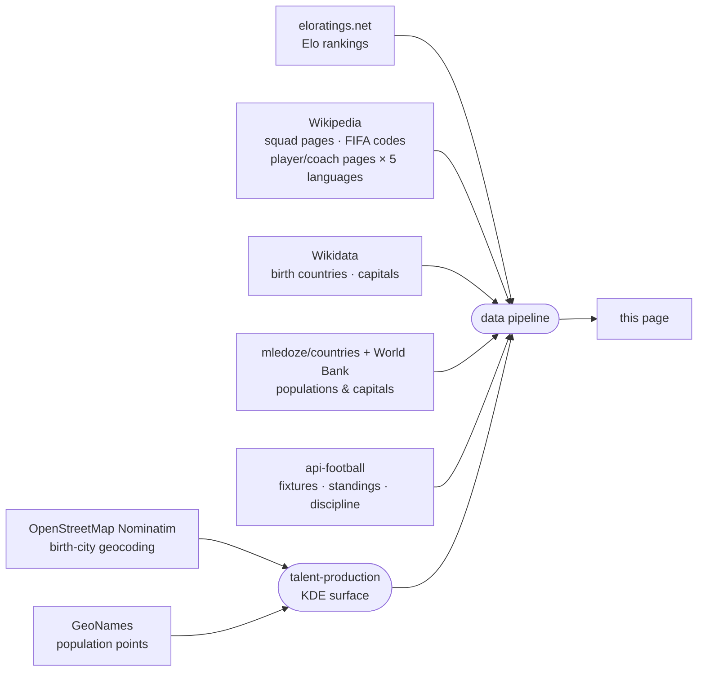

<!-- i18n:data_sources -->
# Datenquellen

| Quelle | Verwendung |
|---|---|
| [eloratings.net](https://www.eloratings.net/) | Weltfußball-Elo-Ranglisten |
| [Wikipedia — WM 2026 Kader](https://en.wikipedia.org/wiki/2026_FIFA_World_Cup_squads) | Spielernamen, Länderspielanzahl, Trikotnummern |
| [Wikipedia-API](https://en.wikipedia.org/w/api.php) | Wikipedia-Seite jedes Spielers und Trainers in 5 Sprachen (en, fr, de, it, es) |
| [Wikipedia — FIFA-Ländercodes](https://en.wikipedia.org/wiki/List_of_FIFA_country_codes) | FIFA-Mitgliedschaft |
| [Wikidata](https://www.wikidata.org/) | Geburtsländer; mehrsprachige Namen der Hauptstädte |
| [mledoze/countries](https://github.com/mledoze/countries) + [Weltbank](https://data.worldbank.org/) | Länderbevölkerungen und Hauptstädte |
| [OpenStreetMap Nominatim](https://nominatim.org/) | Geokodierung der Geburtsstädte, für die Geburtsort-Kartenansicht |
| [GeoNames](https://www.geonames.org/) | Referenz-Bevölkerungspunkte für die Talentproduktions-Kartenebene |
| [api-football](https://www.api-football.com/) | Live-Spielpaarungen, Gruppentabellen, Ergebnisse, Disziplinarstatistiken (Fouls/Karten) |

**Elo-Bewertungen** funktionieren wie das Schach-Bewertungssystem, dem sie ihren Namen verdanken:
Jedes Spiel lässt die Bewertung beider Mannschaften je nach Ergebnis, Torabstand und der Stärke des
Gegners zum Zeitpunkt des Spiels steigen oder fallen — ein Sieg gegen eine sehr hoch bewertete
Mannschaft bringt weit mehr als ein Sieg gegen eine schwache. Anders als die offizielle FIFA-
Weltrangliste, die nur wenige Male pro Jahr aktualisiert wird, wird die Elo-Bewertung nach jedem
Spiel neu berechnet und reagiert sofort auf Ergebnisse — deshalb wird hier
[eloratings.net](https://www.eloratings.net/) als Länderreferenz verwendet statt der offiziellen
FIFA-Liste.

**Die Auflösung des Geburtslandes** ist der heikelste Schritt in der Pipeline.
Die Wikipedia-Kaderseite gibt nicht an, wo Spieler geboren wurden — sie liefert nur ihre Namen
und Links zu ihren individuellen Wikipedia-Seiten.
Die Pipeline nutzt diese Links als Schlüssel zur Abfrage von [Wikidata](https://www.wikidata.org/)
via SPARQL und ruft den eingetragenen Geburtsort jedes Spielers und das Land ab, zu dem dieser Ort gehört.
Diese zweistufige Suche (Wikipedia → Wikidata) ermöglicht es, die geboren-hier / spielt-für-Verbindungen auf der Karte einzuzeichnen.

**Die Talentproduktions-Kartenebene** beantwortet eine andere Frage als „wo wurden die meisten
Spieler geboren" — eine reine Dichtekarte würde nur die Bevölkerung der Megastädte verfolgen.
Stattdessen fragt sie: „produziert dieser Ort mehr WM-2026-Talente, als seine Bevölkerung erwarten
ließe?" Zwei Gauß-Oberflächen werden auf demselben Raster erstellt: eine aus geokodierten
Geburtsstädten von Spielern und Trainern, eine aus einem Referenz-Bevölkerungsdatensatz
([GeoNames](https://www.geonames.org/)) — mit demselben Kernel und derselben Bandbreite, damit
beide zellenweise direkt vergleichbar sind. Die eine durch die andere zu teilen und dann gegen die
globale Rate des Turniers zu normalisieren, ergibt ein *relatives* Risiko — ein Wert von 1 bedeutet
„produziert Talente genau proportional zur dort lebenden Bevölkerung", nicht „produziert absolut
gesehen viele Talente". Deshalb kann eine Megastadt auf dieser Karte unauffällig erscheinen,
während eine kleine, für ihren Fußball bekannte Stadt deutlich hervorsticht: Die Ebene misst
bewusst Über- und Unterdurchschnittlichkeit im Verhältnis zur Bevölkerung, nicht die absolute
Produktion.

**Live-Tabellen** verwenden api-footballs eigene Gruppentabellen-Rangfolge statt einer hier aus den
Ergebnissen berechneten, sodass direkter Vergleich, Fair-Play-Punkte und die übrigen offiziellen
FIFA-Tiebreak-Regeln nie riskieren, von der echten Tabelle in genau dem Grenzfall abzuweichen, für
den diese Regeln überhaupt existieren.

Diese Quellen speisen eine automatisierte Pipeline, die die Rohdaten zusammenführt, abgleicht und anreichert, bevor sie auf dieser Seite veröffentlicht werden.
Elo-Ranglisten und Live-Spieldaten (Spielpaarungen, Tabellen, Disziplinarstatistiken) werden aktualisiert, sobald Ergebnisse vorliegen; Kader-, Geburtsort- und Talentproduktionsdaten werden manuell aktualisiert, wenn sich die Kader ändern.
<!-- /i18n:data_sources -->

