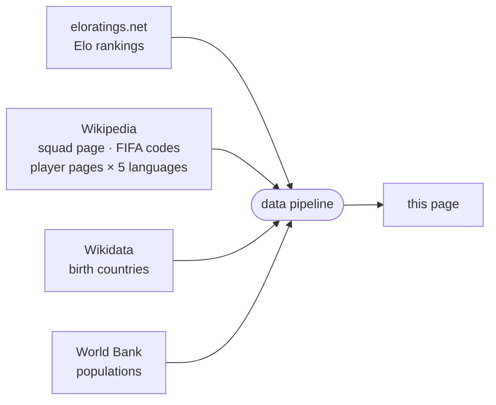

<!-- i18n:page_title -->
# Geboren in / Spielt für
<!-- /i18n:page_title -->

<!-- i18n:intro -->
Diese Karte visualisiert die Kader der Fußball-Weltmeisterschaft 2026 unter dem Gesichtspunkt des Geburtsortes.
Jedes Land ist entsprechend der Gesamtzahl der WM-Spieler eingefärbt, die dort geboren wurden —
unabhängig davon, ob sie dieses oder ein anderes Land vertreten.
<!-- /i18n:intro -->

<!-- i18n:quotes -->
## Die Zitate

Der Kopfbereich zeigt ein rotierendes Karussell mit 15 berühmten Literaturzitaten —
von François Villon (1461) bis Simone de Beauvoir (1949) — jedes humorvoll in ein
Fußball-Zitat verwandelt.

Navigieren Sie zwischen den Zitaten mit den nach links gerichteten Chevrons oder wischen Sie auf Touchscreens nach rechts.
Drücken und halten Sie (oder halten Sie die Maustaste gedrückt) auf ein Zitat, um die Originalzeile anzuzeigen; loslassen, um zurückzukehren.

Ein Wisch nach links öffnet dagegen ein ganz anderes Panel — das Kontrollpanel,
das steuert, wie Länder gefiltert, sortiert und angezeigt werden.
<!-- /i18n:quotes -->

<!-- i18n:control_sidebar -->
## Das Kontrollpanel

Die Schaltfläche <kbd style="background:var(--bg-hover,#f0ede8);border:1px solid var(--border,#e4e0d8);color:var(--text-muted,#999);border-radius:0 4px 4px 0">‹</kbd> in der oberen rechten Ecke des Fensters öffnet das Kontrollpanel,
das steuert, was auf der Karte und in der Länderliste erscheint.

Das Panel hat fünf Teile: eine **Werkzeugleiste** oben; **Sortieren** und **Anzeigen** übereinander links; die **Filter**-Matrix rechts; und eine **Infoleiste** unten.

### Werkzeugleiste

- <kbd style="font-size:.68em;font-family:var(--bs-font-monospace,ui-monospace,monospace);background:var(--bg-hover,#f0ede8);border:1px solid var(--border,#e4e0d8);color:#1C274C;border-radius:3px;padding:2px 4px;vertical-align:middle">ESC</kbd> klappt das Panel wieder zu seiner ‹-Schaltfläche zusammen.
-  filtert die Liste auf eine einzelne FIFA-Konföderation — siehe *FIFA-Konföderationsfilter*, unten.
-  kopiert eine URL, die die aktuelle Konfiguration des Panels wiedergibt, in die Zwischenablage.
-  zeigt, welche URL-Parameter für den aktuellen Zustand aktiv sind — dasselbe Panel, das `?explain` bei jedem Seitenaufruf öffnet.

### Sortieren

Vier umsortierbare Kriterien — **die Elo-Bewertung** (ein unabhängiger Wert, der sich nach jedem Spiel je nach Ergebnis und Stärke des Gegners ändert — siehe *Datenquellen*, unten), **Bevölkerung**, **Δ** (Delta aus spielt-für minus geboren-in), **A–Z** — plus eine Richtungsschaltfläche (↓↑) zum Umkehren von auf-/absteigend. Nur die obersten zwei Kriterien sind tatsächlich aktiv; ein Klick auf ein Kriterium verschiebt es an die erste Stelle.

### Anzeigen

Wechselt die Länderliste zwischen **Teams** (eine Pille pro Land, Standard) und **Spielen** (eine Zeile pro Spielpaarung, Gegner nebeneinander) — siehe *Team-/Spiel-Ansicht*, unten.

### Filter

Die Matrix kreuzt zwei **Spalten** (Exporteur / Nicht-Exporteur) mit vier **Zeilen** in zwei Gruppen:

- **Qualifiziert** — aufgeteilt danach, ob das Land Spieler importiert oder nicht
- **Nicht qualifiziert** — aufgeteilt nach FIFA-Mitgliedschaft

Deaktivieren Sie eine Zelle, um diese Kategorie auszublenden. Klicken Sie auf einen Zeilen- oder Spaltenkopf, um die gesamte Gruppe auf einmal umzuschalten.

### Infoleiste

Zeigt, wie viele Länder derzeit sichtbar sind (von der Gesamtzahl), sowie die Datenquelle (und das letzte Aktualisierungsdatum) für das jeweils oberste Kriterium in der Sortierspalte.

### Team-/Spiel-Ansicht

Der Anzeigen-Schalter bewirkt erst etwas, sobald das Turnierphasen-Karussell — im Tab „Länderliste" unterhalb der Karte, nicht in diesem Panel; siehe *Das untere Panel*, unten — über die **Gruppenphase** hinaus fortgeschritten ist: Vor Beginn der K.-o.-Runden gibt es keine einzelne Spielpaarung, der ein Team zugeordnet werden könnte, daher bleibt er bis dahin deaktiviert.

In der Spiele-Ansicht zeigt jede Zeile beide Teams zu beiden Seiten von Anstoßdatum/Ergebnis:

- Noch nicht gespielt: das Anstoßdatum, und ein wellenförmiger oberer/unterer Rand auf beiden Pillen — ein „noch offen"-Look für ein Spiel, das noch in beide Richtungen ausgehen kann.
- Gespielt: das Ergebnis (plus Elfmeterschießen-Resultat, falls es so weit kam) anstelle des Datums, und die Flagge des Verlierer-Teams ausgegraut.

### FIFA-Konföderationsfilter

Die Schaltfläche  neben der **FIFA**-Zeile öffnet ein Dropdown-Menü, um die Liste auf eine einzelne Konföderation zu filtern. Nicht-FIFA-Länder sind nicht betroffen — sie bleiben entsprechend dem Rest der Filtermatrix sichtbar oder ausgeblendet.

Die Auswahl einer Konföderation hebt zudem ihre Außengrenze auf der Karte hervor und zoomt darauf ein. Wählen Sie **Alle FIFA-Konföderationen**, um den Filter aufzuheben.

### URL-Parameter

Der Filter- und Sortierstatus kann auch direkt über die URL konfiguriert werden — `?sort=`, `?dir=`, `?stage=`, `?show=`, `?fifaconf=`, `?display=`. Fügen Sie `?explain` zu einer beliebigen URL hinzu, um ein Panel zu öffnen, das die aktiven Parameter erklärt. Die vollständige Referenz mit allen Zellcodes, Gruppenaliasen und Beispielen finden Sie im [Länderseiten-Guide](?guide=countries).

### Zur Länderreferenz

Karte und Liste verwenden [eloratings.net](https://www.eloratings.net/) als Länderquelle —
nicht die FIFA-Mitgliederliste. Dies bedeutet, dass die Liste Nicht-FIFA-Territorien wie Grönland enthält,
aber auch besondere Fälle wie die vier britischen Heimnationen — sub-nationale Einheiten
mit eigener FIFA-Mitgliedschaft, die von FIFA und Elo separat anerkannt werden.
Die Standardsortierung erfolgt nach Elo-Bewertung; andere Sortierkriterien sind in der Sortierspalte verfügbar.
<!-- /i18n:control_sidebar -->

<!-- i18n:tax_heading -->
## Länderkategorien
<!-- /i18n:tax_heading -->

<!-- i18n:tax_intro -->
Jedes Land wird als **Pill-Badge** angezeigt, dessen CSS-Stil seine Kategorie auf einen Blick kennzeichnet.
<!-- /i18n:tax_intro -->

<!-- i18n:tax_label_qualified -->
Qualifiziert vs. nicht qualifiziert
<!-- /i18n:tax_label_qualified -->

  
    
    Czech Republic
  
  <!-- i18n:tax_desc_border_yes -->
Durchgezogener Rand — qualifiziert und noch im Turnier.
<!-- /i18n:tax_desc_border_yes -->

  
    
    Iran
  
  <!-- i18n:tax_desc_border_dashed -->
Gestrichelter Rand — qualifiziert, aber ausgeschieden.
<!-- /i18n:tax_desc_border_dashed -->

  
    
    Ukraine
  
  <!-- i18n:tax_desc_border_no -->
Kein Rand — nicht qualifiziert.
<!-- /i18n:tax_desc_border_no -->

<!-- i18n:tax_label_fifa -->
FIFA vs. Nicht-FIFA
<!-- /i18n:tax_label_fifa -->

  
    
    Iceland
  
  <!-- i18n:tax_desc_text_dark -->
Dunkler Text — FIFA-Mitglied.
<!-- /i18n:tax_desc_text_dark -->

  
    
    Greenland
  
  <!-- i18n:tax_desc_text_light -->
Heller Text — kein FIFA-Mitglied.
<!-- /i18n:tax_desc_text_light -->

<!-- i18n:tax_label_born -->
Hier geboren / spielt für
<!-- /i18n:tax_label_born -->

  
    
    Italy
  
  ▶ <!-- i18n:tax_desc_exp -->
Spieler, die in diesem Land geboren wurden, spielen für ein anderes qualifiziertes Land.
<!-- /i18n:tax_desc_exp -->

  
    
    Curaçao
  
  ◀ <!-- i18n:tax_desc_imp -->
Spieler, die in einem anderen Land geboren wurden, spielen für dieses Land.
<!-- /i18n:tax_desc_imp -->

  
    
    France
  
  ◀▶ <!-- i18n:tax_desc_both -->
Spieler aus anderen Ländern spielen für dieses Land, und Spieler aus diesem Land spielen für andere Länder.
<!-- /i18n:tax_desc_both -->

<!-- i18n:tax_note_gradient -->
Der Hintergrund der Pille ist selbst ein Verlauf von Rot (Importe) → Weiß (einheimisch) → Blau (Exporte) — je breiter das Band einer Farbe, desto größer der Anteil dieser Gruppe am gesamten Spielerkader des Landes.
<!-- /i18n:tax_note_gradient -->

  
    
    France
    3 · 81
  
  <!-- i18n:tax_desc_gradient_exp -->
Überwiegend blau — ein starker Exporteur (81) mit nur einer Handvoll Importen (3).
<!-- /i18n:tax_desc_gradient_exp -->

  
    
    England
    7 · 22
  
  <!-- i18n:tax_desc_gradient_mixed -->
Ein sichtbares rotes Band neben dem Blau — eine ausgewogenere Mischung aus Importen (7) und Exporten (22).
<!-- /i18n:tax_desc_gradient_mixed -->

  
    
    Curaçao
    26
  
  <!-- i18n:tax_desc_gradient_imp -->
Fast vollständig rot — fast der gesamte Kader (26) wurde anderswo geboren.
<!-- /i18n:tax_desc_gradient_imp -->

<!-- i18n:tax_label_offmap -->
Nicht auf der Karte
<!-- /i18n:tax_label_offmap -->

<!-- i18n:tax_note_offmap -->
Orthogonal zu den obigen Kategorien.
<!-- /i18n:tax_note_offmap -->

  
    
    Singapore
  
  <!-- i18n:tax_desc_nomap -->
Gedimmte Flagge — zu klein für die Karte.
<!-- /i18n:tax_desc_nomap -->

  
    
    Monaco
  
  <!-- i18n:tax_desc_nomap_nonfifa -->
Ebenso, hier kombiniert mit Nicht-FIFA.
<!-- /i18n:tax_desc_nomap_nonfifa -->

<!-- i18n:tax_label_fixture -->
Spielpaarungen (Spiele-Ansicht)
<!-- /i18n:tax_label_fixture -->

<!-- i18n:tax_note_fixture -->
Nur in der Spiele-Ansicht sichtbar — siehe Team-/Spiel-Ansicht, oben.
<!-- /i18n:tax_note_fixture -->

  
    
      
        
        Morocco
      
    
  
  <!-- i18n:tax_desc_won -->
Grüner Haken auf der Pille — hat ein entschiedenes Spiel gewonnen.
<!-- /i18n:tax_desc_won -->

  
    
    Brazil
  
  <!-- i18n:tax_desc_lost -->
Flagge in Graustufen — hat ein entschiedenes Spiel verloren.
<!-- /i18n:tax_desc_lost -->

  
    
      
      Germany
    
  
  <!-- i18n:tax_desc_pending -->
Wellenförmiger Rand — Spiel noch nicht ausgetragen.
<!-- /i18n:tax_desc_pending -->

<!-- i18n:map -->
## Die Karte

### Choropleth und Flaggen

Jedes Land ist entsprechend der Kennzahl des aktiven Farbthemas eingefärbt (siehe *Die Legende*, unten) —
je dunkler der Farbton, desto höher der Wert. Länder ohne Daten zu dieser Kennzahl erscheinen in einem neutralen hellen Ton.
Länder, die derzeit im Filter enthalten sind, zeigen eine kreisförmige Flaggenmarkierung.

### Zoom und Navigation

Scrollen (oder kneifen) zum Zoomen · ziehen zum Verschieben. Drei runde Schaltflächen schweben in der unteren linken Ecke der Karte:

-  zoomt heraus, um alle Länder in die Ansicht zu passen.
-  — wenn ein Land ausgewählt ist, zoomt und verschiebt, um alle hervorgehobenen Länder auf einmal zu zeigen.
- Eine kleine runde Farbpalette wechselt das Farbthema der Karte — siehe *Die Legende*, unten.

### Die Legende

Die Karte bietet drei Farbthemen, durchlaufen über die oben in *Zoom und Navigation* beschriebene Palettenschaltfläche — jedes färbt Länder nach einer anderen Kennzahl ein:

| Thema | Färbt nach |
|---|---|
| **Divergierend** (Standard) | Netto-Talentbilanz — hausgemachter Beitrag (Exporte + einheimische Spieler) minus Importe. Netto-Exporteure und Netto-Importeure erscheinen in zwei unterschiedlichen Farben zu beiden Seiten eines neutralen Mittelpunkts. |
| **Wald** | Exportanzahl — hier geborene Spieler, die jetzt anderswo spielen. |
| **Erdig** | Importanzahl — anderswo geborene Spieler, die jetzt hier spielen. |

Bei **Divergierend** liest sich der Farbbalken am unteren Rand der Kopfzeile von links nach rechts wie ein Zahlenstrahl — negatives Extrem, neutrale 0 in der Mitte, positives Extrem — mit einer Referenzmarke an jedem Ende und in der Mitte, sowie einem eigenständigen Punkt *an jedem Ende* für das Land, das auf dieser Seite am weitesten außerhalb der Skala liegt (größter Netto-Importeur, größter Netto-Exporteur). Bei **Wald** und **Erdig** verläuft der Balken stattdessen von dunkel nach hell von links nach rechts, mit einem einzigen eigenständigen Punkt für das eine Land, das am weitesten außerhalb der Skala liegt.
Das gewählte Thema bleibt über Besuche hinweg erhalten.

### Tooltips

Fahren Sie mit der Maus über ein Land, um Details zu sehen. Tooltips werden auf Mobilgeräten nicht angezeigt.

- **Geburtsländer**: Exportanzahl und Top-Spieler, jeweils mit ihrer Zielflagge
- **Qualifizierte Länder, die auch rekrutieren**: eine rechte Spalte fügt die Importseite hinzu
- **Nicht qualifizierte Geburtsländer**: ein Badge *nicht qualifiziert* ersetzt das Kader-Panel
<!-- /i18n:map -->

<!-- i18n:bottom_panel -->
## Das untere Panel

Der scrollbare Bereich unter der Karte hat drei Registerkarten.

###  Die Länderliste

Die Standardregisterkarte listet jedes Land als Pill-Badge auf.
Das Kontrollpanel steuert, welche Badges erscheinen und in welcher Reihenfolge;
die Standardsortierung erfolgt nach [Welt-Elo-Bewertung](https://www.eloratings.net/).

Ein kleines Karussell befindet sich über der Liste und durchläuft sieben Positionen: **Gruppenphase → Sechzehntelfinale → Achtelfinale → Viertelfinale → Halbfinale → Finale → Sieger**.

- Verwenden Sie die Pfeile ‹ › oder wischen Sie auf Touchscreens nach links/rechts, um zwischen den Phasen zu wechseln.
- Jede Position filtert qualifizierte Länder auf jene, die diese Phase „erreicht" haben — zu Beginn noch im Turnier, oder bereits Sieger.
- Die Navigation ist auf die vom Turnier tatsächlich erreichte Phase begrenzt; weitere Positionen bleiben gesperrt, bis die entsprechenden Spiele ausgetragen sind.

Das Karussell wirkt als zusätzlicher Filter, zusätzlich zum Kontrollpanel — Sie können beispielsweise
nur Achtelfinal-Mannschaften anzeigen, die auch Exporteure sind, indem Sie das Karussell vorrücken und die Nicht-Exporteur-Spalte im Panel deaktivieren.
Es filtert nur die vier **qualifizierten** Zeilen (Importeur / Nicht-Importeur × Exporteur / Nicht-Exporteur); die vier **nicht qualifizierten** Zeilen (FIFA / Nicht-FIFA × Exporteur / Nicht-Exporteur) sind davon unabhängig und bleiben bei jeder Position unverändert — sie haben keine eigene Turnierphase zu erreichen.

Ein Klick auf ein Badge wählt dieses Land aus und zoomt die Karte darauf.

Für Länder mit **geboren hier / spielt für**-Verbindungen erscheinen auch farbige Pfeile auf der Karte:

- {{ARROW_BLUE}} **blaue Pfeile**: Kader, die Spieler einschließen, die im ausgewählten Land geboren wurden
- {{ARROW_RED}} **rote Pfeile**: Länder, in denen anderswo geborene Spieler für diesen Kader spielen

*Die Pfeilstärke ist proportional zur Anzahl der Spieler.*

Die Schaltfläche  passt dann alle verbundenen Länder in die Ansicht.
Die Schaltfläche  stellt den ursprünglichen Zoom/Ausschnitt wieder her, optimiert, um alle Länder in die Ansicht zu passen.

Klicken Sie erneut auf das aktive Badge, klicken Sie woanders auf die Karte oder drücken Sie **Esc**, um die Auswahl aufzuheben.

### Die Spielertabelle

Wenn ein Land ausgewählt ist, zeigt die Spielertabelle drei Abschnitte:

| Abschnitt | Inhalt |
|---|---|
| **Hier geboren / spielt für ein anderes** | Spieler, die in diesem Land geboren wurden, gruppiert nach dem Kader, den sie vertreten |
| **Hier geboren / spielt für dieses Land** | Spieler, die hier geboren wurden und auch dieses Land vertreten |
| **Woanders geboren / spielt für dieses Land** | Spieler, die in einem anderen Land geboren wurden und für diesen Kader spielen, gruppiert nach Geburtsland |

Spielernamen verlinken auf ihre Wikipedia-Seite in der aktuellen Oberflächensprache, wenn verfügbar.

###  Ketten

Die Ketten-Registerkarte zeigt Sequenzen von Ländern, die durch geboren-hier / spielt-für-Verbindungen verknüpft sind:
ein Spieler, der in A geboren wurde, spielt für B, ein Spieler, der in B geboren wurde, spielt für C — und so weiter,
und bildet eine Kette von Nationalitäten durch das Turnier.
<!-- /i18n:bottom_panel -->

<!-- i18n:data_sources -->
## Datenquellen

| Quelle | Verwendung |
|---|---|
| [eloratings.net](https://www.eloratings.net/) | Weltfußball-Elo-Ranglisten |
| [Wikipedia — WM 2026 Kader](https://en.wikipedia.org/wiki/2026_FIFA_World_Cup_squads) | Spielernamen, Länderspielanzahl |
| [Wikipedia-API](https://en.wikipedia.org/w/api.php) | Wikipedia-Seite jedes Spielers in 5 Sprachen (en, fr, de, it, es) |
| [Wikipedia — FIFA-Ländercodes](https://en.wikipedia.org/wiki/List_of_FIFA_country_codes) | FIFA-Mitgliedschaft |
| [Wikidata](https://www.wikidata.org/) | Geburtsländer |
| [Weltbank](https://data.worldbank.org/) | Länderbevölkerungen |

**Elo-Bewertungen** funktionieren wie das Schach-Bewertungssystem, dem sie ihren Namen verdanken:
Jedes Spiel lässt die Bewertung beider Mannschaften je nach Ergebnis, Torabstand und der Stärke des
Gegners zum Zeitpunkt des Spiels steigen oder fallen — ein Sieg gegen eine sehr hoch bewertete
Mannschaft bringt weit mehr als ein Sieg gegen eine schwache. Anders als die offizielle FIFA-
Weltrangliste, die nur wenige Male pro Jahr aktualisiert wird, wird die Elo-Bewertung nach jedem
Spiel neu berechnet und reagiert sofort auf Ergebnisse — deshalb wird hier
[eloratings.net](https://www.eloratings.net/) als Länderreferenz verwendet statt der offiziellen
FIFA-Liste.

**Die Auflösung des Geburtslandes** ist der heikelste Schritt in der Pipeline.
Die Wikipedia-Kaderseite gibt nicht an, wo Spieler geboren wurden — sie liefert nur ihre Namen
und Links zu ihren individuellen Wikipedia-Seiten.
Die Pipeline nutzt diese Links als Schlüssel zur Abfrage von [Wikidata](https://www.wikidata.org/)
via SPARQL und ruft den eingetragenen Geburtsort jedes Spielers und das Land ab, zu dem dieser Ort gehört.
Diese zweistufige Suche (Wikipedia → Wikidata) ermöglicht es, die geboren-hier / spielt-für-Verbindungen auf der Karte einzuzeichnen.

Diese Quellen speisen eine automatisierte Pipeline, die die Rohdaten zusammenführt, abgleicht und anreichert, bevor sie auf dieser Seite veröffentlicht werden.
Elo-Ranglisten werden täglich aktualisiert; Kaderdaten werden manuell aktualisiert, wenn sich die Kader ändern.
<!-- /i18n:data_sources -->

