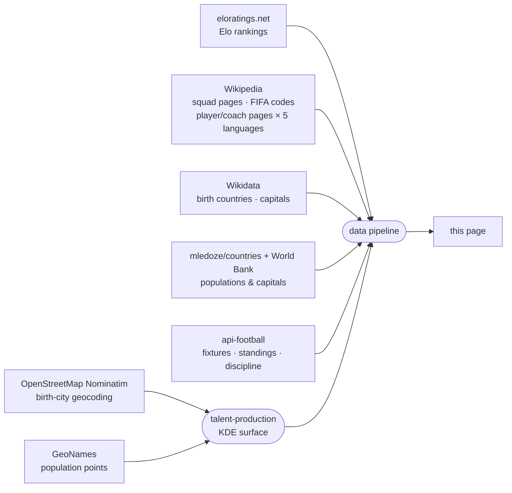

<!-- i18n:data_sources -->
# Fuentes de datos

| Fuente | Uso |
|---|---|
| [eloratings.net](https://www.eloratings.net/) | Rankings Elo de fútbol mundial |
| [Wikipedia — convocatorias Mundial 2026](https://en.wikipedia.org/wiki/2026_FIFA_World_Cup_squads) | Nombres de jugadores, internacionalidades, números de camiseta |
| [API de Wikipedia](https://en.wikipedia.org/w/api.php) | Página Wikipedia de cada jugador y entrenador en 5 idiomas (en, fr, de, it, es) |
| [Wikipedia — códigos de países FIFA](https://en.wikipedia.org/wiki/List_of_FIFA_country_codes) | Membresía FIFA |
| [Wikidata](https://www.wikidata.org/) | Países de nacimiento; nombres de capitales en varios idiomas |
| [mledoze/countries](https://github.com/mledoze/countries) + [Banco Mundial](https://data.worldbank.org/) | Poblaciones y capitales de los países |
| [OpenStreetMap Nominatim](https://nominatim.org/) | Geocodificación de ciudades de nacimiento, para la vista de ciudades de nacimiento en el mapa |
| [GeoNames](https://www.geonames.org/) | Puntos de población de referencia para la capa de producción de talento |
| [api-football](https://www.api-football.com/) | Partidos en vivo, clasificaciones de grupo, resultados, estadísticas disciplinarias (faltas/tarjetas) |

**Las clasificaciones Elo** funcionan como el sistema de puntuación del ajedrez del que toman su
nombre: cada partido hace subir o bajar la puntuación de ambos equipos según el resultado, la
diferencia de goles y la fuerza del rival en el momento del partido — vencer a un equipo muy bien
clasificado vale mucho más que vencer a uno débil. A diferencia del ranking oficial de la FIFA, que
solo se actualiza unas pocas veces al año, la clasificación Elo se recalcula después de cada partido
y reacciona de inmediato a los resultados — por eso aquí se usa
[eloratings.net](https://www.eloratings.net/) como referencia de países en lugar de la lista oficial
de la FIFA.

**La resolución del país de nacimiento** es el paso más delicado del pipeline.
La página de convocatorias de Wikipedia no indica dónde nacieron los jugadores — solo proporciona sus nombres
y enlaces a sus páginas individuales de Wikipedia.
El pipeline usa esos enlaces como claves para consultar [Wikidata](https://www.wikidata.org/)
mediante SPARQL, recuperando el lugar de nacimiento registrado de cada jugador y el país al que pertenece ese lugar.
Esta búsqueda en dos pasos (Wikipedia → Wikidata) es lo que hace posible trazar las conexiones nacido-aquí / juega-para en el mapa.
El lugar de nacimiento registrado en Wikidata es a veces incorrecto — apunta a una entidad de país o región en lugar de a una ciudad real, a veces incluso al país de la selección nacional del jugador en vez de su verdadero lugar de nacimiento — o carece por completo de detalle a nivel de ciudad. Estos casos se corrigen a mano cotejándolos con la ficha de Wikipedia del propio jugador cuando puede encontrarse; un número muy reducido de jugadores todavía cuenta solo con datos de nacimiento a nivel de país, o sin ningún lugar de nacimiento resuelto.

**La capa de producción de talento** responde a una pregunta distinta de "dónde nacieron más
jugadores" — un mapa de densidad bruta simplemente seguiría la población de las megaciudades. En
cambio pregunta: "¿este lugar produce más talento para el Mundial 2026 del que su población haría
prever?" Se construyen dos superficies gaussianas sobre la misma cuadrícula: una a partir de las
ciudades de nacimiento geocodificadas de jugadores y entrenadores, otra a partir de un conjunto de
datos de población de referencia ([GeoNames](https://www.geonames.org/)), usando el mismo kernel y
el mismo ancho de banda para que ambas sean directamente comparables celda a celda. Dividir una
entre la otra, y luego normalizar respecto a la tasa global del torneo, da un riesgo *relativo* —
un valor de 1 significa "produce talento exactamente proporcional a la población que vive allí", no
"produce mucho talento en términos absolutos". Por eso una megaciudad puede aparecer como normal en
este mapa mientras una pequeña ciudad conocida por su fútbol destaca: la capa mide deliberadamente
el rendimiento por encima o por debajo de lo esperado en relación con la población, no la
producción bruta.
La geocodificación en texto libre de ciudades también puede, en ocasiones, hacer coincidir el lugar equivocado con el mismo nombre — casos detectados y corregidos mediante revisión manual en lugar de darse por buenos sin más.

**Las clasificaciones en vivo** usan el propio ranking de grupo de api-football en lugar de uno
calculado aquí a partir de los resultados, de modo que el enfrentamiento directo, los puntos de
disciplina y el resto de las reglas oficiales de desempate de la FIFA nunca corren el riesgo de
discrepar de la clasificación real justo en el caso límite para el que existen esas reglas.

Estas fuentes alimentan un pipeline automatizado que fusiona, cruza y enriquece los datos brutos antes de publicarlos en esta página.
Los rankings Elo y los datos de partidos en vivo (partidos, clasificaciones, estadísticas disciplinarias) se actualizan a medida que llegan los resultados; los datos de convocatorias, lugares de nacimiento y producción de talento se actualizan manualmente cuando cambian las selecciones.
<!-- /i18n:data_sources -->

