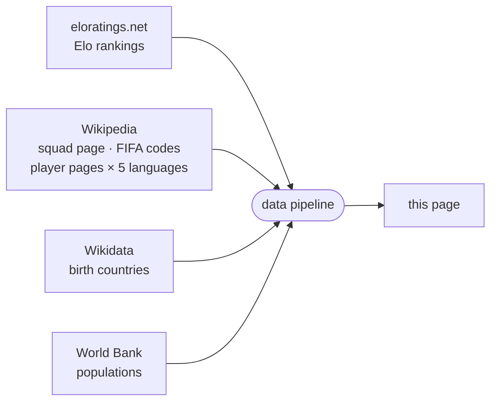

<!-- i18n:page_title -->
# Nacido en / Juega para
<!-- /i18n:page_title -->

<!-- i18n:intro -->
Este mapa visualiza las convocatorias del Mundial 2026 desde la perspectiva del lugar de nacimiento.
Cada país se colorea según el número total de jugadores del torneo nacidos allí —
ya sea que representen a ese país o a otro.
<!-- /i18n:intro -->

<!-- i18n:quotes -->
## Las citas

El encabezado muestra un carrusel rotativo de 15 famosas citas literarias —
de François Villon (1461) a Simone de Beauvoir (1949) — cada una convertida con humor
en una frase futbolística.

Navega entre las citas usando los chevrones orientados hacia la izquierda, o desliza hacia la derecha en pantallas táctiles.
Mantén presionado (o mantén el botón del ratón pulsado) sobre una cita para revelar la línea original; suelta para volver.

Deslizar hacia la izquierda, en cambio, revela un panel completamente distinto — el panel de control,
que rige cómo se filtran, ordenan y muestran los países.
<!-- /i18n:quotes -->

<!-- i18n:control_sidebar -->
## El panel de control

El botón <kbd style="background:var(--bg-hover,#f0ede8);border:1px solid var(--border,#e4e0d8);color:var(--text-muted,#999);border-radius:0 4px 4px 0">‹</kbd> en la esquina superior derecha de la ventana abre el panel de control,
que controla qué aparece en el mapa y en la lista de países.

El panel tiene cinco partes: una **barra de herramientas** arriba; **Ordenar** y **Ver** apiladas a la izquierda; la matriz de **Filtrar** a la derecha; y una **barra de información** abajo.

### Barra de herramientas

- <kbd style="font-size:.68em;font-family:var(--bs-font-monospace,ui-monospace,monospace);background:var(--bg-hover,#f0ede8);border:1px solid var(--border,#e4e0d8);color:#1C274C;border-radius:3px;padding:2px 4px;vertical-align:middle">ESC</kbd> vuelve a colapsar el panel a su botón ‹.
-  filtra la lista a una sola confederación FIFA — ver *Filtro por confederación FIFA*, abajo.
-  copia al portapapeles una URL que reproduce la configuración actual del panel.
-  muestra qué parámetros de URL están activos para el estado actual — el mismo panel que abre `?explain` en cada carga de página.

### Ordenar

Cuatro criterios reordenables — **la clasificación Elo** (una puntuación independiente que cambia después de cada partido según el resultado y la fuerza del rival — ver *Fuentes de datos*, abajo), **población**, **Δ** (delta juega-por menos nacido-en), **A–Z** — más un botón de dirección (↓↑) para invertir ascendente/descendente. Solo los dos criterios superiores están realmente activos; al hacer clic en un criterio se mueve a la primera posición.

### Ver

Cambia la lista de países entre **Equipos** (una insignia por país, por defecto) y **Partidos** (una fila por enfrentamiento, rivales uno junto al otro) — ver *Vista equipos / partidos*, abajo.

### Filtrar

La matriz cruza dos **columnas** (exportador / no exportador) con cuatro **filas** en dos grupos:

- **Clasificados** — divididos según si el país importa jugadores o no
- **No clasificados** — divididos por pertenencia a la FIFA

Desactiva una celda para ocultar esa categoría. Haz clic en un encabezado de fila o columna para alternar todo el grupo a la vez.

### Barra de información

Muestra cuántos países son visibles actualmente (del total), y la fuente de datos (y la fecha de última actualización) para el criterio situado más arriba en la columna de orden.

### Vista equipos / partidos

El interruptor Ver no tiene efecto hasta que el carrusel de fases del torneo — en la pestaña "Lista de países" debajo del mapa, no en este panel; ver *El panel inferior*, abajo — avanza más allá de la **Fase de grupos**: antes de que comiencen las eliminatorias no existe un único enfrentamiento al que se pueda asociar un equipo, así que hasta entonces permanece desactivado.

En la vista de partidos, cada fila muestra ambos equipos a los dos lados de la fecha/resultado:

- Aún no jugado: la fecha del partido, y un borde superior/inferior ondulado en ambas insignias — un aspecto "pendiente" para un partido que aún puede resolverse en cualquier dirección.
- Jugado: el resultado (más el resultado de penaltis, si se llegó a eso) en lugar de la fecha, y la bandera del equipo perdedor atenuada.

### Filtro por confederación FIFA

El botón  junto a la fila **FIFA** abre un menú desplegable para filtrar la lista a una sola confederación. Los países no FIFA no se ven afectados — permanecen visibles u ocultos según el resto de la matriz de filtros.

Seleccionar una confederación también resalta su frontera exterior en el mapa y hace zoom sobre ella. Selecciona **Todas las confederaciones FIFA** para quitar el filtro.

### Parámetros de URL

El estado de filtro y orden también puede configurarse directamente mediante la URL — `?sort=`, `?dir=`, `?stage=`, `?show=`, `?fifaconf=`, `?display=`. Añade `?explain` a cualquier URL para abrir un panel que explica los parámetros activos. La referencia completa con todos los códigos de celda, alias de grupo y ejemplos está en la [guía de páginas de país](?guide=countries).

### Sobre la referencia de países

El mapa y la lista usan [eloratings.net](https://www.eloratings.net/) como fuente de países —
no la lista de miembros de la FIFA. Esto significa que la lista incluye territorios no pertenecientes a la FIFA como Groenlandia,
pero también casos especiales como las cuatro naciones constituyentes del Reino Unido — entidades subnacionales
con membresía FIFA propia, reconocidas por separado por la FIFA y por Elo.
El orden por defecto es por puntuación Elo; otros criterios de orden están disponibles en la columna de orden.
<!-- /i18n:control_sidebar -->

<!-- i18n:tax_heading -->
## Categorías de países
<!-- /i18n:tax_heading -->

<!-- i18n:tax_intro -->
Cada país se muestra como una **pastilla** cuyo estilo CSS codifica su categoría de un vistazo.
<!-- /i18n:tax_intro -->

<!-- i18n:tax_label_qualified -->
Clasificado vs. no clasificado
<!-- /i18n:tax_label_qualified -->

  
    
    Czech Republic
  
  <!-- i18n:tax_desc_border_yes -->
Borde sólido — clasificado y aún en el torneo.
<!-- /i18n:tax_desc_border_yes -->

  
    
    Iran
  
  <!-- i18n:tax_desc_border_dashed -->
Borde discontinuo — clasificado pero eliminado.
<!-- /i18n:tax_desc_border_dashed -->

  
    
    Ukraine
  
  <!-- i18n:tax_desc_border_no -->
Sin borde — no clasificado.
<!-- /i18n:tax_desc_border_no -->

<!-- i18n:tax_label_fifa -->
FIFA vs. no-FIFA
<!-- /i18n:tax_label_fifa -->

  
    
    Iceland
  
  <!-- i18n:tax_desc_text_dark -->
Texto oscuro — miembro de la FIFA.
<!-- /i18n:tax_desc_text_dark -->

  
    
    Greenland
  
  <!-- i18n:tax_desc_text_light -->
Texto claro — no miembro de la FIFA.
<!-- /i18n:tax_desc_text_light -->

<!-- i18n:tax_label_born -->
Nacido aquí / juega para
<!-- /i18n:tax_label_born -->

  
    
    Italy
  
  ▶ <!-- i18n:tax_desc_exp -->
Jugadores nacidos en este país juegan para otro país clasificado.
<!-- /i18n:tax_desc_exp -->

  
    
    Curaçao
  
  ◀ <!-- i18n:tax_desc_imp -->
Jugadores nacidos en otro país juegan para este país.
<!-- /i18n:tax_desc_imp -->

  
    
    France
  
  ◀▶ <!-- i18n:tax_desc_both -->
Jugadores nacidos en otro país juegan para este país, y jugadores nacidos aquí juegan para otros países.
<!-- /i18n:tax_desc_both -->

<!-- i18n:tax_note_gradient -->
El fondo de la píldora es a su vez un degradado rojo (importaciones) → blanco (nativos) → azul (exportaciones) — cuanto más ancha la banda de un color, mayor la proporción de ese grupo en la plantilla total del país.
<!-- /i18n:tax_note_gradient -->

  
    
    France
    3 · 81
  
  <!-- i18n:tax_desc_gradient_exp -->
Predominantemente azul — un gran exportador (81) con solo un puñado de importaciones (3).
<!-- /i18n:tax_desc_gradient_exp -->

  
    
    England
    7 · 22
  
  <!-- i18n:tax_desc_gradient_mixed -->
Una banda roja visible junto al azul — una mezcla más equilibrada de importaciones (7) y exportaciones (22).
<!-- /i18n:tax_desc_gradient_mixed -->

  
    
    Curaçao
    26
  
  <!-- i18n:tax_desc_gradient_imp -->
Casi enteramente rojo — casi toda la plantilla (26) nació en otro lugar.
<!-- /i18n:tax_desc_gradient_imp -->

<!-- i18n:tax_label_offmap -->
Fuera del mapa
<!-- /i18n:tax_label_offmap -->

<!-- i18n:tax_note_offmap -->
Ortogonal a las categorías anteriores.
<!-- /i18n:tax_note_offmap -->

  
    
    Singapore
  
  <!-- i18n:tax_desc_nomap -->
Bandera atenuada — demasiado pequeño para aparecer en el mapa.
<!-- /i18n:tax_desc_nomap -->

  
    
    Monaco
  
  <!-- i18n:tax_desc_nomap_nonfifa -->
Ídem, aquí combinado con no-FIFA.
<!-- /i18n:tax_desc_nomap_nonfifa -->

<!-- i18n:tax_label_fixture -->
Enfrentamientos (vista de partidos)
<!-- /i18n:tax_label_fixture -->

<!-- i18n:tax_note_fixture -->
Visible solo en la vista de partidos — ver Vista equipos / partidos, arriba.
<!-- /i18n:tax_note_fixture -->

  
    
      
        
        Morocco
      
    
  
  <!-- i18n:tax_desc_won -->
Marca verde en la píldora — ganó un partido decidido.
<!-- /i18n:tax_desc_won -->

  
    
    Brazil
  
  <!-- i18n:tax_desc_lost -->
Bandera en escala de grises — perdió un partido decidido.
<!-- /i18n:tax_desc_lost -->

  
    
      
      Germany
    
  
  <!-- i18n:tax_desc_pending -->
Borde ondulado — partido aún no jugado.
<!-- /i18n:tax_desc_pending -->

<!-- i18n:map -->
## El mapa

### Coropletas y banderas

Cada país está coloreado según la métrica del tema de color activo (ver *La leyenda*, abajo) —
cuanto más oscuro el tono, mayor el valor. Los países sin datos para esa métrica aparecen en un tono claro neutro.
Los países actualmente incluidos en el filtro muestran un marcador de bandera circular.

### Zoom y desplazamiento

Desplázate (o pellizca) para hacer zoom · arrastra para desplazar la vista. Tres botones redondos flotan en la esquina inferior izquierda del mapa:

-  aleja el zoom para encajar todos los países en la vista.
-  — cuando hay un país seleccionado, hace zoom y desplaza la vista para mostrar todos los países resaltados a la vez.
- Una pequeña paleta redonda cambia el tema de color del mapa — ver *La leyenda*, abajo.

### La leyenda

El mapa ofrece tres temas de color, recorribles mediante el botón de paleta descrito arriba en *Zoom y desplazamiento* — cada uno colorea los países según una métrica distinta:

| Tema | Colorea por |
|---|---|
| **Divergente** (por defecto) | Balance neto de talento — contribución local (exportaciones + jugadores nativos) menos importaciones. Exportadores netos e importadores netos aparecen en dos colores distintos a cada lado de un punto neutro central. |
| **Bosque** | Número de exportaciones — jugadores nacidos aquí que ahora juegan en otro lugar. |
| **Tierra** | Número de importaciones — jugadores nacidos en otro lugar que ahora juegan aquí. |

Con **Divergente**, la barra de color en la parte inferior de la cabecera se lee de izquierda a derecha como una recta numérica — extremo negativo, cero neutro en el centro, extremo positivo — con una marca de referencia en cada extremo y en el centro, más un punto independiente *en cada extremo* para el país más fuera de escala de ese lado (el mayor importador neto, el mayor exportador neto). Con **Bosque** y **Tierra**, la barra va en cambio de oscuro a claro de izquierda a derecha, con un único punto independiente para el único país más fuera de escala.
El tema elegido se mantiene entre visitas.

### Información emergente

Pasa el ratón sobre un país para ver detalles. Las ventanas emergentes no se muestran en dispositivos móviles.

- **Países de nacimiento**: número de exportaciones y mejores jugadores, cada uno con su bandera de destino
- **Países clasificados que también reclutan**: una columna derecha añade el lado de las importaciones
- **Países de nacimiento no clasificados**: una insignia *no clasificado* sustituye al panel de la plantilla
<!-- /i18n:map -->

<!-- i18n:bottom_panel -->
## El panel inferior

El área desplazable bajo el mapa tiene tres pestañas.

###  La lista de países

La pestaña por defecto lista cada país como una insignia tipo píldora.
El panel de control determina qué insignias aparecen y en qué orden;
el orden por defecto es por [puntuación Elo mundial](https://www.eloratings.net/).

Un pequeño carrusel se sitúa encima de la lista y recorre siete posiciones: **Fase de grupos → Dieciseisavos → Octavos → Cuartos → Semifinales → Final → Campeón**.

- Usa las flechas ‹ › o desliza a izquierda/derecha en pantallas táctiles para cambiar de fase.
- Cada posición filtra los países clasificados a los que han "alcanzado" esa fase — todavía en el torneo al principio, o ya campeones.
- La navegación está limitada a la fase realmente alcanzada por el torneo; las posiciones posteriores permanecen bloqueadas hasta que se disputen los partidos correspondientes.

El carrusel actúa como un filtro adicional, junto con el panel de control — puedes, por ejemplo,
mostrar solo los equipos de octavos que también sean exportadores avanzando el carrusel y desactivando la columna de no exportador en el panel.
Solo filtra las cuatro filas de **clasificados** (importador / no importador × exportador / no exportador); las cuatro filas de **no clasificados** (FIFA / no FIFA × exportador / no exportador) son independientes de esto y permanecen sin cambios en cada posición — no tienen una fase del torneo propia que alcanzar.

Haz clic en una insignia para seleccionar ese país y hacer zoom en el mapa sobre él.

Para países con vínculos **nacido aquí / juega por**, también aparecen flechas de colores en el mapa:

- {{ARROW_BLUE}} **flechas azules**: plantillas que incluyen jugadores nacidos en el país seleccionado
- {{ARROW_RED}} **flechas rojas**: países donde jugadores nacidos en otro lugar juegan para esta plantilla

*El grosor de la flecha es proporcional al número de jugadores.*

El botón  ajusta entonces la vista a todos los países vinculados a la vez.
El botón  restablece el zoom/desplazamiento inicial, optimizado para encajar todos los países en la vista.

Haz clic de nuevo en la insignia activa, haz clic en otro lugar del mapa, o pulsa **Esc** para deseleccionar.

### La tabla de jugadores

Cuando hay un país seleccionado, la tabla de jugadores muestra tres secciones:

| Sección | Contenido |
|---|---|
| **Nacidos aquí / juegan por otro país** | Jugadores nacidos en este país, agrupados por la plantilla que representan |
| **Nacidos aquí / juegan por este país** | Jugadores nacidos aquí que también representan a este país |
| **Nacidos en otro lugar / juegan por este país** | Jugadores nacidos en otro país que juegan para esta plantilla, agrupados por país de nacimiento |

Los nombres de los jugadores enlazan a su página de Wikipedia en el idioma de la interfaz actual, cuando está disponible.

###  Cadenas

La pestaña Cadenas muestra secuencias de países vinculados por relaciones nacido-aquí / juega-por:
un jugador nacido en A juega por B, un jugador nacido en B juega por C — y así sucesivamente,
formando una cadena de nacionalidades a través del torneo.
<!-- /i18n:bottom_panel -->

<!-- i18n:data_sources -->
## Fuentes de datos

| Fuente | Uso |
|---|---|
| [eloratings.net](https://www.eloratings.net/) | Rankings Elo de fútbol mundial |
| [Wikipedia — convocatorias Mundial 2026](https://en.wikipedia.org/wiki/2026_FIFA_World_Cup_squads) | Nombres de jugadores, internacionalidades |
| [API de Wikipedia](https://en.wikipedia.org/w/api.php) | Página Wikipedia de cada jugador en 5 idiomas (en, fr, de, it, es) |
| [Wikipedia — códigos de países FIFA](https://en.wikipedia.org/wiki/List_of_FIFA_country_codes) | Membresía FIFA |
| [Wikidata](https://www.wikidata.org/) | Países de nacimiento |
| [Banco Mundial](https://data.worldbank.org/) | Poblaciones de los países |

**Las clasificaciones Elo** funcionan como el sistema de puntuación del ajedrez del que toman su
nombre: cada partido hace subir o bajar la puntuación de ambos equipos según el resultado, la
diferencia de goles y la fuerza del rival en el momento del partido — vencer a un equipo muy bien
clasificado vale mucho más que vencer a uno débil. A diferencia del ranking oficial de la FIFA, que
solo se actualiza unas pocas veces al año, la clasificación Elo se recalcula después de cada partido
y reacciona de inmediato a los resultados — por eso aquí se usa
[eloratings.net](https://www.eloratings.net/) como referencia de países en lugar de la lista oficial
de la FIFA.

**La resolución del país de nacimiento** es el paso más delicado del pipeline.
La página de convocatorias de Wikipedia no indica dónde nacieron los jugadores — solo proporciona sus nombres
y enlaces a sus páginas individuales de Wikipedia.
El pipeline usa esos enlaces como claves para consultar [Wikidata](https://www.wikidata.org/)
mediante SPARQL, recuperando el lugar de nacimiento registrado de cada jugador y el país al que pertenece ese lugar.
Esta búsqueda en dos pasos (Wikipedia → Wikidata) es lo que hace posible trazar las conexiones nacido-aquí / juega-para en el mapa.

Estas fuentes alimentan un pipeline automatizado que fusiona, cruza y enriquece los datos brutos antes de publicarlos en esta página.
Los rankings Elo se actualizan diariamente; los datos de convocatorias se actualizan manualmente cuando cambian las selecciones.
<!-- /i18n:data_sources -->

