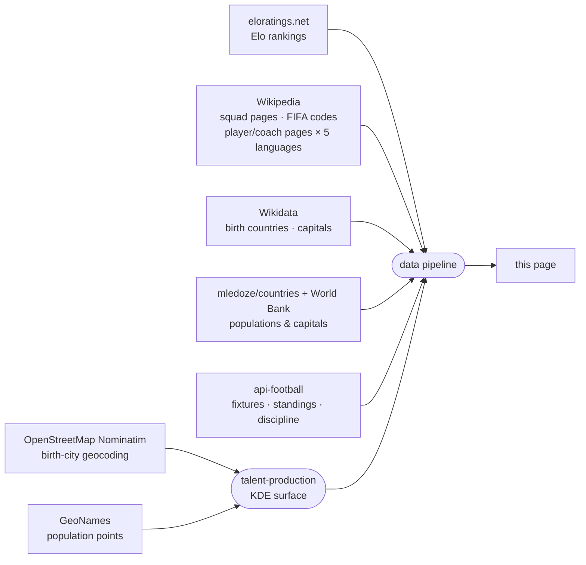

<!-- i18n:data_sources -->
# Sources de données

| Source | Utilisation |
|---|---|
| [eloratings.net](https://www.eloratings.net/) | Classements Elo du football mondial |
| [Wikipedia — effectifs Coupe du Monde 2026](https://en.wikipedia.org/wiki/2026_FIFA_World_Cup_squads) | Noms des joueurs, nombre de sélections, numéros de maillot |
| [API Wikipedia](https://en.wikipedia.org/w/api.php) | Page Wikipedia de chaque joueur et entraîneur en 5 langues (en, fr, de, it, es) |
| [Wikipedia — codes pays FIFA](https://en.wikipedia.org/wiki/List_of_FIFA_country_codes) | Appartenance à la FIFA |
| [Wikidata](https://www.wikidata.org/) | Pays de naissance ; noms des capitales en plusieurs langues |
| [mledoze/countries](https://github.com/mledoze/countries) + [Banque mondiale](https://data.worldbank.org/) | Populations et capitales des pays |
| [OpenStreetMap Nominatim](https://nominatim.org/) | Géocodage des villes de naissance, pour la vue des villes de naissance sur la carte |
| [GeoNames](https://www.geonames.org/) | Points de population de référence pour la couche de production de talents |
| [api-football](https://www.api-football.com/) | Rencontres en direct, classements de groupe, résultats, statistiques disciplinaires (fautes/cartons) |

**Le classement Elo** fonctionne comme le système d'échecs dont il tire son nom : chaque match fait
monter ou descendre la cote des deux équipes selon le résultat, l'écart de buts, et la force de
l'adversaire au moment du match — battre une équipe très bien classée rapporte bien plus que battre
une équipe faible. Contrairement au classement officiel FIFA, mis à jour seulement quelques fois par an,
le classement Elo est recalculé après chaque match et réagit immédiatement aux résultats — c'est
pourquoi [eloratings.net](https://www.eloratings.net/) est utilisé ici comme référence des pays plutôt
que la liste officielle de la FIFA.

**La résolution du pays de naissance** est l'étape la plus délicate du pipeline.
La page Wikipedia des effectifs n'indique pas où les joueurs sont nés — elle fournit seulement leurs noms
et des liens vers leurs pages Wikipedia individuelles.
Le pipeline utilise ces liens comme clés pour interroger [Wikidata](https://www.wikidata.org/)
via SPARQL, récupérant le lieu de naissance enregistré de chaque joueur et le pays auquel ce lieu appartient.
Cette recherche en deux étapes (Wikipedia → Wikidata) est ce qui rend possible de tracer les connexions né ici / joue pour sur la carte.
Le lieu de naissance enregistré dans Wikidata est parfois erroné — pointant vers une entité pays ou région plutôt qu'une ville réelle, parfois même le pays de l'équipe nationale du joueur plutôt que son lieu de naissance réel — ou sans détail au niveau de la ville. Ces cas sont corrigés à la main en se référant à l'infobox Wikipedia du joueur lorsqu'elle est trouvable ; un très petit nombre de joueurs ne disposent encore que d'une donnée de naissance au niveau du pays, voire d'aucun lieu de naissance résolu.

**La couche de production de talents** répond à une question différente de « où sont nés le plus de
joueurs » — une carte de densité brute se contenterait de suivre la population des mégapoles. Elle
demande plutôt : « cet endroit produit-il plus de talents pour la Coupe du Monde 2026 que sa
population ne le laisserait prévoir ? » Deux surfaces gaussiennes sont construites sur la même
grille : l'une à partir des villes de naissance géocodées des joueurs et entraîneurs, l'autre à
partir d'un jeu de données de population de référence ([GeoNames](https://www.geonames.org/)), en
utilisant le même noyau et la même largeur de bande pour que les deux soient directement comparables
case par case. Diviser l'une par l'autre, puis normaliser par rapport au taux mondial du tournoi,
donne un risque *relatif* — une valeur de 1 signifie « produit des talents exactement
proportionnellement à la population qui y vit », pas « produit beaucoup de talents en valeur
absolue ». C'est pourquoi une mégapole peut apparaître comme ordinaire sur cette carte tandis qu'une
petite ville connue pour son football ressort nettement : la couche mesure délibérément la sur- et
la sous-performance par rapport à la population, pas la production brute.
Le géocodage en texte libre des villes peut aussi, à l'occasion, faire correspondre le mauvais lieu portant le même nom — des cas repérés et corrigés lors d'une relecture manuelle plutôt que pris pour argent comptant.

**Les classements en direct** utilisent le classement de groupe propre à api-football plutôt qu'un
classement recalculé à partir des scores ici, de sorte que les confrontations directes, les points
de discipline et le reste des règles officielles de départage de la FIFA ne risquent jamais de
diverger du vrai classement sur un cas particulier que ces règles existent justement pour trancher.

Ces sources alimentent un pipeline automatisé qui fusionne, croise et enrichit les données brutes avant de les publier sur cette page.
Les classements Elo et les données en direct (rencontres, classements, statistiques disciplinaires) sont actualisés au fil des résultats ; les données d'effectifs, de lieux de naissance et de production de talents sont mises à jour manuellement lorsque les sélections changent.
<!-- /i18n:data_sources -->

