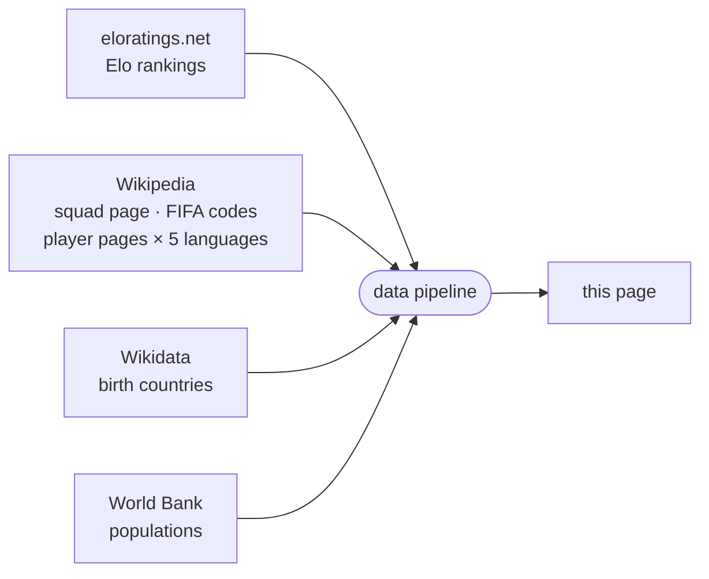

<!-- i18n:page_title -->
# Né en / Joue pour
<!-- /i18n:page_title -->

<!-- i18n:intro -->
Cette carte visualise les effectifs de la Coupe du Monde 2026 sous l'angle du lieu de naissance.
Chaque pays est coloré selon le nombre total de joueurs du Mondial qui y sont nés —
qu'ils représentent ce pays ou un autre.
<!-- /i18n:intro -->

<!-- i18n:quotes -->
## Les citations

L'en-tête affiche un carrousel de 15 citations littéraires célèbres —
de François Villon (1461) à Simone de Beauvoir (1949) — chacune détournée avec humour
en citation footballistique.

Naviguez entre les citations à l'aide des chevrons orientés vers la gauche, ou faites glisser vers la droite sur les écrans tactiles.
Maintenez appuyé (ou gardez le bouton de la souris enfoncé) sur une citation pour révéler la ligne originale ; relâchez pour revenir.

Faire glisser vers la gauche, en revanche, révèle un tout autre panneau — le panneau de contrôle,
qui régit le filtrage, le tri et l'affichage des pays.
<!-- /i18n:quotes -->

<!-- i18n:control_sidebar -->
## Le panneau de contrôle

Le bouton <kbd style="background:var(--bg-hover,#f0ede8);border:1px solid var(--border,#e4e0d8);color:var(--text-muted,#999);border-radius:0 4px 4px 0">‹</kbd> dans le coin supérieur droit de la fenêtre ouvre le panneau de contrôle,
pour contrôler ce qui apparaît sur la carte et dans la liste des pays.

Le panneau comporte cinq parties : une **barre d'outils** en haut ; **tri** et **affichage** empilés à gauche ; la matrice de **filtre** à droite ; et une **barre d'info** en bas.

### Barre d'outils

- <kbd style="font-size:.68em;font-family:var(--bs-font-monospace,ui-monospace,monospace);background:var(--bg-hover,#f0ede8);border:1px solid var(--border,#e4e0d8);color:#1C274C;border-radius:3px;padding:2px 4px;vertical-align:middle">ESC</kbd> réduit le panneau et le ramène à son bouton ‹.
-  filtre la liste sur une seule confédération FIFA — voir *Filtre confédérations FIFA*, ci-dessous.
-  copie dans le presse-papiers une URL reproduisant la configuration actuelle du panneau.
-  affiche les paramètres d'URL actifs pour l'état actuel — le même panneau que `?explain` ouvre au chargement de la page.

### Tri

Quatre critères réorganisables — **le classement Elo** (une cote indépendante qui évolue après chaque match selon le résultat et la force de l'adversaire — voir *Sources des données*, plus bas), **population**, **Δ** (delta joue-pour moins né-dans), **A–Z** — plus un bouton de sens (↓↑) pour inverser croissant/décroissant. Seuls les deux premiers critères sont réellement actifs ; cliquez sur un critère pour le placer en tête de liste.

### Affichage

Bascule la liste des pays entre **équipes** (une pastille par pays, par défaut) et **matchs** (une ligne par rencontre, adversaires côte à côte) — voir *Vue équipes / matchs*, ci-dessous.

### Filtre

La matrice croise deux **colonnes** (exportateur / non-exportateur) avec quatre **lignes** en deux groupes :

- **Qualifiés** — selon que le pays importe des joueurs ou non
- **Non qualifiés** — selon l'appartenance à la FIFA

Décochez une cellule pour masquer cette catégorie. Cliquez sur un en-tête de ligne ou de colonne pour basculer tout le groupe d'un coup.

### Barre d'info

Indique combien de pays sont actuellement visibles sur le total, ainsi que la source des données (et la date de mise à jour) pour le critère actuellement en tête de la colonne de tri.

### Vue équipes / matchs

Le bouton d'affichage n'a d'effet qu'une fois que le carrousel de phase du tournoi — dans l'onglet Liste des pays sous la carte, pas dans ce panneau ; voir *Le panneau inférieur*, ci-dessous — a dépassé la **Phase de groupes** : il n'y a pas de rencontre unique à apparier avant le début des phases à élimination directe, donc il reste désactivé jusque-là.

En vue matchs, chaque ligne montre les deux équipes de part et d'autre de la date/du score :

- Pas encore joué : la date du coup d'envoi, et une bordure ondulée en haut et en bas des deux pastilles — un aspect « en cours de décision » pour une rencontre qui peut encore tourner dans un sens ou dans l'autre.
- Joué : le score (plus le résultat des tirs au but, le cas échéant) à la place de la date, et le drapeau de l'équipe perdante grisé.

### Filtre confédérations FIFA

Le bouton  à côté de la ligne **FIFA** ouvre un menu déroulant pour filtrer la liste sur une seule confédération. Les pays non-FIFA ne sont pas affectés — ils restent visibles ou masqués selon le reste de la matrice de filtre.

La sélection d'une confédération met également en évidence sa frontière externe sur la carte et effectue un zoom pour l'ajuster à la vue. Sélectionnez **Toutes les confédérations FIFA** pour supprimer le filtre.

### Paramètres d'URL

L'état du filtre et du tri peut aussi être configuré directement depuis l'URL — `?sort=`, `?dir=`, `?stage=`, `?show=`, `?fifaconf=`, `?display=`. Ajoutez `?explain` à n'importe quelle URL pour ouvrir un panneau décrivant l'effet des paramètres actifs. La référence complète avec tous les codes de cellule, alias de groupe et exemples se trouve dans le [guide de la page Pays](?guide=countries).

### À propos de la référence des pays

La carte et la liste utilisent [eloratings.net](https://www.eloratings.net/) comme source des pays —
et non la liste des membres de la FIFA. Cela signifie que la liste inclut des territoires non-FIFA tels que le Groenland,
mais aussi des cas particuliers comme les quatre nations britanniques — entités sous-nationales
possédant leur propre adhésion à la FIFA, reconnues séparément par la FIFA et par Elo.
Le tri par défaut est par classement Elo ; d'autres critères de tri sont disponibles dans la colonne de tri.
<!-- /i18n:control_sidebar -->

<!-- i18n:tax_heading -->
## Catégories de pays
<!-- /i18n:tax_heading -->

<!-- i18n:tax_intro -->
Chaque pays est affiché sous forme de **pastille** dont le style CSS encode sa catégorie en un coup d'œil.
<!-- /i18n:tax_intro -->

<!-- i18n:tax_label_qualified -->
Qualifié vs. non qualifié
<!-- /i18n:tax_label_qualified -->

  
    
    Czech Republic
  
  <!-- i18n:tax_desc_border_yes -->
Bordure pleine — qualifié et toujours en lice.
<!-- /i18n:tax_desc_border_yes -->

  
    
    Iran
  
  <!-- i18n:tax_desc_border_dashed -->
Bordure pointillée — qualifié mais éliminé.
<!-- /i18n:tax_desc_border_dashed -->

  
    
    Ukraine
  
  <!-- i18n:tax_desc_border_no -->
Pas de bordure — non qualifié.
<!-- /i18n:tax_desc_border_no -->

<!-- i18n:tax_label_fifa -->
FIFA vs. non-FIFA
<!-- /i18n:tax_label_fifa -->

  
    
    Iceland
  
  <!-- i18n:tax_desc_text_dark -->
Texte foncé — membre de la FIFA.
<!-- /i18n:tax_desc_text_dark -->

  
    
    Greenland
  
  <!-- i18n:tax_desc_text_light -->
Texte clair — non membre de la FIFA.
<!-- /i18n:tax_desc_text_light -->

<!-- i18n:tax_label_born -->
Né ici / joue pour
<!-- /i18n:tax_label_born -->

  
    
    Italy
  
  ▶ <!-- i18n:tax_desc_exp -->
Des joueurs nés dans ce pays jouent pour un autre pays qualifié.
<!-- /i18n:tax_desc_exp -->

  
    
    Curaçao
  
  ◀ <!-- i18n:tax_desc_imp -->
Des joueurs nés dans un autre pays jouent pour ce pays.
<!-- /i18n:tax_desc_imp -->

  
    
    France
  
  ◀▶ <!-- i18n:tax_desc_both -->
Des joueurs nés ailleurs jouent pour ce pays, et des joueurs nés ici jouent pour d'autres pays.
<!-- /i18n:tax_desc_both -->

<!-- i18n:tax_note_gradient -->
L'arrière-plan de la pastille est lui-même un dégradé rouge (imports) → blanc (natifs) → bleu (exports) — plus la bande d'une couleur est large, plus la part de ce groupe dans l'effectif total du pays est grande.
<!-- /i18n:tax_note_gradient -->

  
    
    France
    3 · 81
  
  <!-- i18n:tax_desc_gradient_exp -->
Majoritairement bleu — un gros exportateur (81) avec seulement une poignée d'imports (3).
<!-- /i18n:tax_desc_gradient_exp -->

  
    
    England
    7 · 22
  
  <!-- i18n:tax_desc_gradient_mixed -->
Une bande rouge visible à côté du bleu — un mélange plus équilibré d'imports (7) et d'exports (22).
<!-- /i18n:tax_desc_gradient_mixed -->

  
    
    Curaçao
    26
  
  <!-- i18n:tax_desc_gradient_imp -->
Presque entièrement rouge — la quasi-totalité de l'effectif (26) est née ailleurs.
<!-- /i18n:tax_desc_gradient_imp -->

<!-- i18n:tax_label_offmap -->
Hors carte
<!-- /i18n:tax_label_offmap -->

<!-- i18n:tax_note_offmap -->
Orthogonal aux catégories ci-dessus.
<!-- /i18n:tax_note_offmap -->

  
    
    Singapore
  
  <!-- i18n:tax_desc_nomap -->
Drapeau estompé — trop petit pour apparaître sur la carte.
<!-- /i18n:tax_desc_nomap -->

  
    
    Monaco
  
  <!-- i18n:tax_desc_nomap_nonfifa -->
Idem, ici combiné avec non-FIFA.
<!-- /i18n:tax_desc_nomap_nonfifa -->

<!-- i18n:tax_label_fixture -->
Rencontres (vue matchs)
<!-- /i18n:tax_label_fixture -->

<!-- i18n:tax_note_fixture -->
Visible uniquement en vue matchs — voir Vue équipes / matchs, ci-dessus.
<!-- /i18n:tax_note_fixture -->

  
    
      
        
        Morocco
      
    
  
  <!-- i18n:tax_desc_won -->
Coche verte sur la pastille — a gagné une rencontre décidée.
<!-- /i18n:tax_desc_won -->

  
    
    Brazil
  
  <!-- i18n:tax_desc_lost -->
Drapeau en niveaux de gris — a perdu une rencontre décidée.
<!-- /i18n:tax_desc_lost -->

  
    
      
      Germany
    
  
  <!-- i18n:tax_desc_pending -->
Bordure ondulée — rencontre pas encore jouée.
<!-- /i18n:tax_desc_pending -->

<!-- i18n:map -->
## La carte

### Choroplèthe et drapeaux

Chaque pays est coloré selon la mesure du thème de couleur actif (voir *La légende*, ci-dessous) —
plus la teinte est foncée, plus la valeur est élevée. Les pays sans donnée pour cette mesure apparaissent dans un ton pâle neutre.
Les pays actuellement inclus dans le filtre affichent un drapeau circulaire.

### Zoom et déplacement

Faites défiler (ou pincez) pour zoomer · faites glisser pour déplacer. Trois boutons ronds flottent dans le coin inférieur gauche de la carte :

-  dézoome pour faire tenir tous les pays dans la vue.
-  — lorsqu'un pays est sélectionné, zoome et déplace pour faire tenir tous les pays mis en évidence.
- Une petite pastille de couleur circulaire fait défiler le thème de couleur de la carte — voir *La légende*, ci-dessous.

### La légende

La carte propose trois thèmes de couleur, parcourus via le bouton pastille décrit dans *Zoom et déplacement* ci-dessus — chacun colore les pays selon une mesure différente :

| Thème | Coloré selon |
|---|---|
| **Divergent** (par défaut) | Le bilan net de talent — contribution locale (exports + joueurs natifs) moins les imports. Les exportateurs nets et les importateurs nets se lisent en deux couleurs différentes de part et d'autre d'un point neutre. |
| **Forêt** | Le nombre d'exports — joueurs nés ici, jouant désormais ailleurs. |
| **Terre** | Le nombre d'imports — joueurs nés ailleurs, jouant désormais ici. |

Pour **Divergent**, la barre de couleur en bas de l'en-tête se lit de gauche à droite comme une droite numérique — extrême négatif, 0 neutre au milieu, extrême positif — avec une graduation de référence à chaque extrémité et au milieu, et un point isolé *à chaque extrémité* pour le pays le plus hors échelle de ce côté (plus gros importateur net, plus gros exportateur net). Pour **Forêt** et **Terre**, la barre va au contraire du foncé au pâle de gauche à droite, avec un seul point isolé pour l'unique pays le plus hors échelle.
Le thème choisi est conservé d'une visite à l'autre.

### Infobulles

Survolez un pays pour voir les détails. Les infobulles ne s'affichent pas sur mobile.

- **Pays de naissance** : nombre d'exports et meilleurs joueurs, chacun avec le drapeau de destination
- **Pays qualifiés qui recrutent aussi** : une colonne de droite ajoute le côté import
- **Pays de naissance non qualifiés** : un badge *non qualifié* remplace le panneau de sélection
<!-- /i18n:map -->

<!-- i18n:bottom_panel -->
## Le panneau inférieur

La zone défilante sous la carte comporte trois onglets.

###  La liste des pays

L'onglet par défaut liste tous les pays sous forme de pastilles.
Le panneau de contrôle détermine quelles pastilles apparaissent et dans quel ordre ;
le tri par défaut est par [classement Elo mondial](https://www.eloratings.net/).

Un petit carrousel se trouve au-dessus de la liste, parcourant sept positions : **Phase de groupes → 16es de finale → 8es de finale → Quarts de finale → Demi-finales → Finale → Vainqueur**.

- Utilisez les flèches ‹ ›, ou faites glisser vers la gauche/droite sur écran tactile, pour changer de phase.
- Chaque position filtre les pays qualifiés jusqu'à ceux qui ont « atteint » cette phase — encore en lice à son coup d'envoi, ou l'ayant déjà remportée.
- La navigation est limitée à la phase la plus avancée réellement atteinte par le tournoi ; les positions suivantes restent verrouillées tant que les matchs correspondants ne sont pas joués.

Le carrousel agit comme un filtre supplémentaire, en plus du panneau de contrôle — vous pouvez, par exemple,
n'afficher que les équipes des 8es de finale qui sont aussi exportatrices en avançant le carrousel et en décochant la colonne non-exportateurs dans le panneau.
Il ne filtre que les quatre lignes **qualifiés** (importateur / non-importateur × exportateur / non-exportateur) ; les quatre lignes **non qualifiés** (FIFA / non-FIFA × exportateur / non-exportateur) lui sont orthogonales et restent inchangées à toute position — elles n'ont pas de phase de tournoi propre à atteindre.

Cliquer sur une pastille sélectionne ce pays et zoome la carte dessus.

Pour les pays avec des connexions **né ici / joue pour**, des flèches colorées apparaissent aussi sur la carte :

- {{ARROW_BLUE}} **flèches bleues** : sélections qui incluent des joueurs nés dans le pays sélectionné
- {{ARROW_RED}} **flèches rouges** : pays où des joueurs nés ailleurs jouent pour cette sélection

*L'épaisseur des flèches est proportionnelle au nombre de joueurs.*

Le bouton  fait alors tenir tous les pays connectés dans la vue.
Le bouton  restaure le zoom/déplacement initial, optimisé pour faire tenir tous les pays dans la vue.

Cliquez à nouveau sur la pastille active, cliquez ailleurs sur la carte, ou appuyez sur **Échap** pour désélectionner.

### Le tableau des joueurs

Lorsqu'un pays est sélectionné, le tableau des joueurs affiche trois sections :

| Section | Contenu |
|---|---|
| **Né ici / joue pour un autre** | Joueurs nés dans ce pays, groupés par la sélection qu'ils représentent |
| **Né ici / joue pour ce pays** | Joueurs nés ici qui représentent aussi ce pays |
| **Né ailleurs / joue pour ce pays** | Joueurs nés dans un autre pays qui représentent cette sélection, groupés par pays de naissance |

Les noms des joueurs renvoient vers leur page Wikipedia dans la langue de l'interface lorsqu'elle est disponible.

###  Chaînes

L'onglet des chaînes affiche des séquences de pays reliés par des connexions né ici / joue pour :
un joueur né en A joue pour B, un joueur né en B joue pour C — et ainsi de suite,
formant une chaîne de nationalités à travers le tournoi.
<!-- /i18n:bottom_panel -->

<!-- i18n:data_sources -->
## Sources de données

| Source | Utilisation |
|---|---|
| [eloratings.net](https://www.eloratings.net/) | Classements Elo du football mondial |
| [Wikipedia — effectifs Coupe du Monde 2026](https://en.wikipedia.org/wiki/2026_FIFA_World_Cup_squads) | Noms des joueurs, nombre de sélections |
| [API Wikipedia](https://en.wikipedia.org/w/api.php) | Page Wikipedia de chaque joueur en 5 langues (en, fr, de, it, es) |
| [Wikipedia — codes pays FIFA](https://en.wikipedia.org/wiki/List_of_FIFA_country_codes) | Appartenance à la FIFA |
| [Wikidata](https://www.wikidata.org/) | Pays de naissance |
| [Banque mondiale](https://data.worldbank.org/) | Populations des pays |

**Le classement Elo** fonctionne comme le système d'échecs dont il tire son nom : chaque match fait
monter ou descendre la cote des deux équipes selon le résultat, l'écart de buts, et la force de
l'adversaire au moment du match — battre une équipe très bien classée rapporte bien plus que battre
une équipe faible. Contrairement au classement officiel FIFA, mis à jour seulement quelques fois par an,
le classement Elo est recalculé après chaque match et réagit immédiatement aux résultats — c'est
pourquoi [eloratings.net](https://www.eloratings.net/) est utilisé ici comme référence des pays plutôt
que la liste officielle de la FIFA.

**La résolution du pays de naissance** est l'étape la plus délicate du pipeline.
La page Wikipedia des effectifs n'indique pas où les joueurs sont nés — elle fournit seulement leurs noms
et des liens vers leurs pages Wikipedia individuelles.
Le pipeline utilise ces liens comme clés pour interroger [Wikidata](https://www.wikidata.org/)
via SPARQL, récupérant le lieu de naissance enregistré de chaque joueur et le pays auquel ce lieu appartient.
Cette recherche en deux étapes (Wikipedia → Wikidata) est ce qui rend possible de tracer les connexions né ici / joue pour sur la carte.

Ces sources alimentent un pipeline automatisé qui fusionne, croise et enrichit les données brutes avant de les publier sur cette page.
Les classements Elo sont actualisés quotidiennement ; les données des effectifs sont mises à jour manuellement lorsque les sélections changent.
<!-- /i18n:data_sources -->

