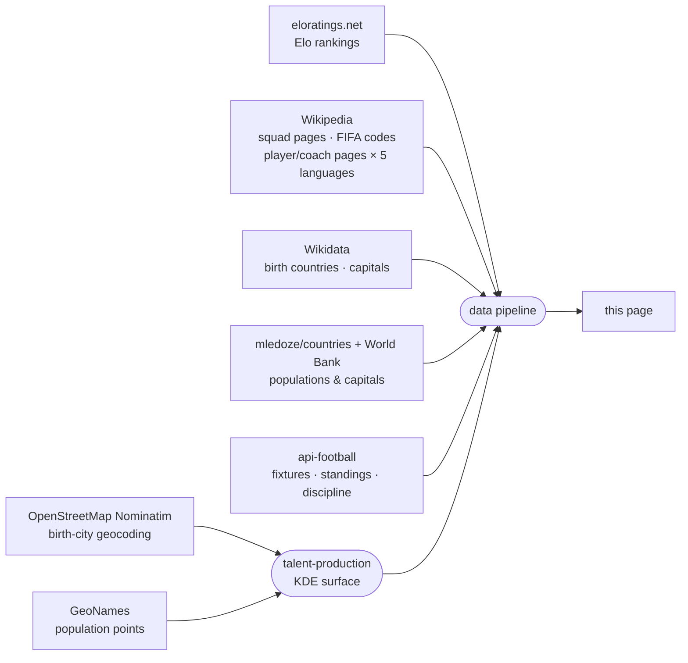

<!-- i18n:data_sources -->
# Fonti dei dati

| Fonte | Utilizzo |
|---|---|
| [eloratings.net](https://www.eloratings.net/) | Ranking Elo del calcio mondiale |
| [Wikipedia — rose Mondiali 2026](https://en.wikipedia.org/wiki/2026_FIFA_World_Cup_squads) | Nomi dei giocatori, presenze in nazionale, numeri di maglia |
| [API Wikipedia](https://en.wikipedia.org/w/api.php) | Pagina Wikipedia di ogni giocatore e allenatore in 5 lingue (en, fr, de, it, es) |
| [Wikipedia — codici paese FIFA](https://en.wikipedia.org/wiki/List_of_FIFA_country_codes) | Appartenenza alla FIFA |
| [Wikidata](https://www.wikidata.org/) | Paesi di nascita; nomi delle capitali in più lingue |
| [mledoze/countries](https://github.com/mledoze/countries) + [Banca Mondiale](https://data.worldbank.org/) | Popolazioni e capitali dei paesi |
| [OpenStreetMap Nominatim](https://nominatim.org/) | Geocodifica delle città di nascita, per la vista delle città di nascita sulla mappa |
| [GeoNames](https://www.geonames.org/) | Punti di popolazione di riferimento per il livello di produzione di talenti |
| [api-football](https://www.api-football.com/) | Partite in diretta, classifiche di girone, risultati, statistiche disciplinari (falli/cartellini) |

**Il ranking Elo** funziona come il sistema di valutazione degli scacchi da cui prende il nome: ogni
partita fa salire o scendere il punteggio di entrambe le squadre in base al risultato, alla differenza
reti e alla forza dell'avversario al momento della partita — battere una squadra molto quotata vale
molto più che battere una squadra debole. A differenza della classifica ufficiale FIFA, aggiornata
solo poche volte l'anno, il ranking Elo viene ricalcolato dopo ogni partita e reagisce immediatamente
ai risultati — per questo qui si usa [eloratings.net](https://www.eloratings.net/) come riferimento
dei paesi invece della lista ufficiale FIFA.

**La risoluzione del paese di nascita** è il passaggio più delicato del pipeline.
La pagina Wikipedia delle rose non indica dove sono nati i giocatori — fornisce solo i loro nomi
e i link alle loro pagine Wikipedia individuali.
Il pipeline usa quei link come chiavi per interrogare [Wikidata](https://www.wikidata.org/)
tramite SPARQL, recuperando il luogo di nascita registrato di ogni giocatore e il paese a cui appartiene quel luogo.
Questa ricerca in due fasi (Wikipedia → Wikidata) è ciò che rende possibile tracciare le connessioni nato-qui / gioca-per sulla mappa.
Il luogo di nascita registrato su Wikidata è talvolta errato — punta a un'entità paese o regione anziché a una città reale, a volte persino al paese della nazionale del giocatore invece del suo effettivo luogo di nascita — oppure manca del tutto il dettaglio a livello di città. Questi casi vengono corretti manualmente confrontandoli con l'infobox Wikipedia del giocatore, quando reperibile; un numero molto ridotto di giocatori dispone ancora solo di dati di nascita a livello di paese, o di nessun luogo di nascita risolto.

**Il livello di produzione di talenti** risponde a una domanda diversa da "dove sono nati più
giocatori" — una mappa di densità grezza si limiterebbe a seguire la popolazione delle megalopoli.
Chiede invece: "questo luogo produce più talenti per il Mondiale 2026 di quanto la sua popolazione
farebbe prevedere?" Due superfici gaussiane vengono costruite sulla stessa griglia: una dalle città
di nascita geocodificate di giocatori e allenatori, l'altra da un set di dati di popolazione di
riferimento ([GeoNames](https://www.geonames.org/)), usando lo stesso kernel e la stessa larghezza
di banda in modo che le due siano direttamente confrontabili cella per cella. Dividere l'una per
l'altra, poi normalizzare rispetto al tasso globale del torneo, dà un rischio *relativo* — un
valore di 1 significa "produce talenti esattamente proporzionalmente alla popolazione che vi
abita", non "produce molti talenti in termini assoluti". Ecco perché una megalopoli può risultare
ordinaria su questa mappa mentre una piccola città nota per il calcio risalta: il livello misura
deliberatamente la sovra- e sotto-prestazione rispetto alla popolazione, non la produzione grezza.
Anche la geocodifica in testo libero delle città può occasionalmente far corrispondere il luogo sbagliato con lo stesso nome — casi individuati e corretti tramite revisione manuale anziché essere presi per buoni.

**Le classifiche in diretta** usano il ranking di girone proprio di api-football invece di uno
calcolato qui dai risultati, così che gli scontri diretti, i punti disciplina e il resto delle
regole ufficiali FIFA di spareggio non rischino mai di discostarsi dalla classifica reale proprio
nel caso limite per cui quelle regole esistono.

Queste fonti alimentano un pipeline automatizzato che unisce, incrocia e arricchisce i dati grezzi prima di pubblicarli su questa pagina.
I ranking Elo e i dati delle partite in diretta (partite, classifiche, statistiche disciplinari) vengono aggiornati man mano che arrivano i risultati; i dati di rose, città di nascita e produzione di talenti vengono aggiornati manualmente quando le selezioni cambiano.
<!-- /i18n:data_sources -->

