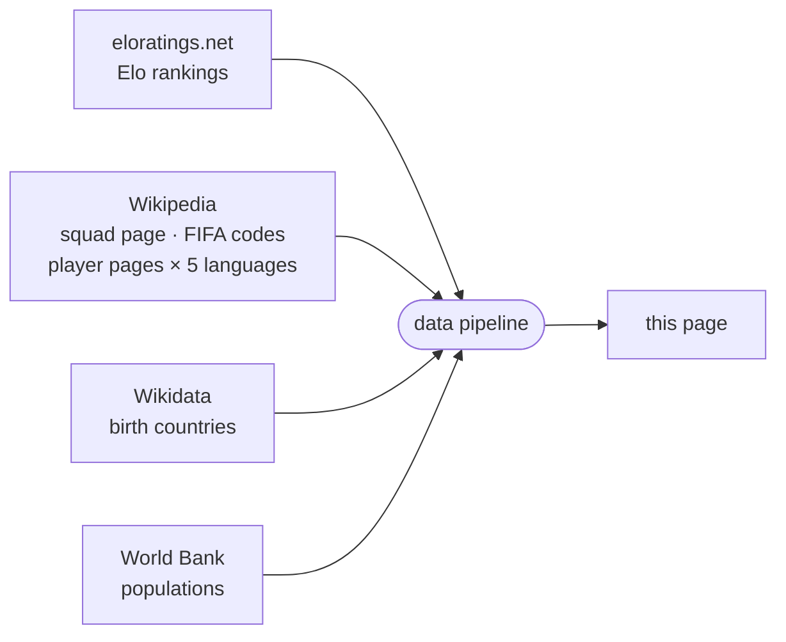

<!-- i18n:page_title -->
# Nato in / Gioca per
<!-- /i18n:page_title -->

<!-- i18n:intro -->
Questa mappa visualizza le rose dei Mondiali 2026 dal punto di vista del luogo di nascita.
Ogni paese è colorato in base al numero totale di giocatori del torneo nati lì —
che rappresentino quel paese o un altro.
<!-- /i18n:intro -->

<!-- i18n:quotes -->
## Le citazioni

L'intestazione mostra un carosello rotante di 15 famose citazioni letterarie —
da François Villon (1461) a Simone de Beauvoir (1949) — ognuna trasformata con umorismo
in una battuta calcistica.

Naviga tra le citazioni usando i chevron orientati verso sinistra, o scorri verso destra su schermi touch.
Tieni premuto (o tieni premuto il pulsante del mouse) su una citazione per rivelare la riga originale; rilascia per tornare.

Scorrere verso sinistra, invece, apre un pannello completamente diverso — il pannello di controllo,
che regola come i paesi vengono filtrati, ordinati e visualizzati.
<!-- /i18n:quotes -->

<!-- i18n:control_sidebar -->
## Il pannello di controllo

Il pulsante <kbd style="background:var(--bg-hover,#f0ede8);border:1px solid var(--border,#e4e0d8);color:var(--text-muted,#999);border-radius:0 4px 4px 0">‹</kbd> nell'angolo superiore destro della finestra apre il pannello di controllo,
che controlla cosa appare sulla mappa e nell'elenco dei paesi.

Il pannello ha cinque parti: una **barra degli strumenti** in alto; **Ordina** e **Visualizza** impilati a sinistra; la matrice **Filtra** a destra; e una **barra informativa** in basso.

### Barra degli strumenti

-  richiude il pannello nel suo pulsante ‹.
-  filtra l'elenco su una singola confederazione FIFA — vedi *Filtro per confederazione FIFA*, sotto.
-  copia un URL che riproduce la configurazione corrente del pannello.
-  mostra quali parametri URL sono attivi per lo stato corrente — lo stesso pannello che `?explain` apre a ogni caricamento di pagina.

### Ordina

Quattro criteri riordinabili — **il ranking Elo** (un punteggio indipendente che cambia dopo ogni partita in base al risultato e alla forza dell'avversario — vedi *Fonti dei dati*, sotto), **popolazione**, **Δ** (delta gioca-per meno nato-in), **A–Z** — più un pulsante di direzione (↓↑) per invertire crescente/decrescente. Solo i primi due criteri sono effettivamente attivi; cliccando su un criterio lo si sposta in prima posizione.

### Visualizza

Cambia l'elenco dei paesi tra **Squadre** (un badge per paese, predefinito) e **Partite** (una riga per accoppiamento, avversari affiancati) — vedi *Vista squadre / partite*, sotto.

### Filtra

La matrice incrocia due **colonne** (esportatore / non esportatore) con quattro **righe** in due gruppi:

- **Qualificati** — suddivisi in base al fatto che il paese importi giocatori o meno
- **Non qualificati** — suddivisi per appartenenza FIFA

Disattiva una cella per nascondere quella categoria. Clicca su un'intestazione di riga o colonna per attivare/disattivare l'intero gruppo in una volta.

### Barra informativa

Mostra quanti paesi sono attualmente visibili (sul totale), e la fonte dei dati (e la data dell'ultimo aggiornamento) per il criterio più in alto nella colonna di ordinamento.

### Vista squadre / partite

L'interruttore Visualizza non ha effetto finché il carosello delle fasi del torneo — nella scheda "Elenco paesi" sotto la mappa, non in questo pannello; vedi *Il pannello inferiore*, sotto — non è avanzato oltre la **Fase a gironi**: prima dell'inizio degli scontri diretti non esiste un singolo accoppiamento a cui una squadra possa essere associata, quindi fino ad allora resta disattivato.

Nella vista partite, ogni riga mostra entrambe le squadre ai due lati della data/risultato:

- Non ancora giocata: la data del calcio d'inizio, e un bordo superiore/inferiore ondulato su entrambi i badge — un aspetto "in sospeso" per una partita che può ancora andare in entrambe le direzioni.
- Giocata: il risultato (più l'esito dei rigori, se si è arrivati a tanto) al posto della data, e la bandiera della squadra perdente sbiadita.

### Filtro per confederazione FIFA

Il pulsante  accanto alla riga **FIFA** apre un menu a tendina per filtrare l'elenco su una singola confederazione. I paesi non FIFA non sono interessati — restano visibili o nascosti secondo il resto della matrice dei filtri.

Selezionare una confederazione evidenzia anche il suo confine esterno sulla mappa e vi esegue lo zoom. Seleziona **Tutte le confederazioni FIFA** per rimuovere il filtro.

### Parametri URL

Lo stato di filtro e ordinamento può essere configurato anche direttamente tramite l'URL — `?sort=`, `?dir=`, `?stage=`, `?show=`, `?fifaconf=`, `?display=`. Aggiungi `?explain` a qualsiasi URL per aprire un pannello che spiega i parametri attivi. Il riferimento completo con tutti i codici delle celle, gli alias dei gruppi e gli esempi si trova nella [guida delle pagine paese](?guide=countries).

### Sulla fonte di riferimento dei paesi

Mappa ed elenco usano [eloratings.net](https://www.eloratings.net/) come fonte dei paesi —
non l'elenco dei membri FIFA. Questo significa che l'elenco include territori non FIFA come la Groenlandia,
ma anche casi particolari come le quattro nazioni costitutive del Regno Unito — entità sub-nazionali
con appartenenza FIFA propria, riconosciute separatamente da FIFA ed Elo.
L'ordinamento predefinito è per rating Elo; altri criteri di ordinamento sono disponibili nella colonna di ordinamento.
<!-- /i18n:control_sidebar -->

<!-- i18n:tax_heading -->
## Categorie di paesi
<!-- /i18n:tax_heading -->

<!-- i18n:tax_intro -->
Ogni paese è mostrato come una **pillola** il cui stile CSS ne codifica la categoria a colpo d'occhio.
<!-- /i18n:tax_intro -->

<!-- i18n:tax_label_qualified -->
Qualificato vs. non qualificato
<!-- /i18n:tax_label_qualified -->

  
    
    Czech Republic
  
  <!-- i18n:tax_desc_border_yes -->
Bordo pieno — qualificato e ancora nel torneo.
<!-- /i18n:tax_desc_border_yes -->

  
    
    Iran
  
  <!-- i18n:tax_desc_border_dashed -->
Bordo tratteggiato — qualificato ma eliminato.
<!-- /i18n:tax_desc_border_dashed -->

  
    
    Ukraine
  
  <!-- i18n:tax_desc_border_no -->
Nessun bordo — non qualificato.
<!-- /i18n:tax_desc_border_no -->

<!-- i18n:tax_label_fifa -->
FIFA vs. non-FIFA
<!-- /i18n:tax_label_fifa -->

  
    
    Iceland
  
  <!-- i18n:tax_desc_text_dark -->
Testo scuro — membro FIFA.
<!-- /i18n:tax_desc_text_dark -->

  
    
    Greenland
  
  <!-- i18n:tax_desc_text_light -->
Testo chiaro — non membro FIFA.
<!-- /i18n:tax_desc_text_light -->

<!-- i18n:tax_label_born -->
Nato qui / gioca per
<!-- /i18n:tax_label_born -->

  
    
    Italy
  
  ▶ <!-- i18n:tax_desc_exp -->
Giocatori nati in questo paese giocano per un altro paese qualificato.
<!-- /i18n:tax_desc_exp -->

  
    
    Curaçao
  
  ◀ <!-- i18n:tax_desc_imp -->
Giocatori nati in un altro paese giocano per questo paese.
<!-- /i18n:tax_desc_imp -->

  
    
    France
  
  ◀▶ <!-- i18n:tax_desc_both -->
Giocatori nati altrove giocano per questo paese, e giocatori nati qui giocano per altri paesi.
<!-- /i18n:tax_desc_both -->

<!-- i18n:tax_note_gradient -->
Lo sfondo della pillola è a sua volta un gradiente rosso (importazioni) → bianco (nativi) → blu (esportazioni) — più larga la banda di un colore, maggiore la quota di quel gruppo nella rosa totale del paese.
<!-- /i18n:tax_note_gradient -->

  
    
    France
    3 · 81
  
  <!-- i18n:tax_desc_gradient_exp -->
Prevalentemente blu — un grande esportatore (81) con solo una manciata di importazioni (3).
<!-- /i18n:tax_desc_gradient_exp -->

  
    
    England
    7 · 22
  
  <!-- i18n:tax_desc_gradient_mixed -->
Una banda rossa visibile accanto al blu — un mix più equilibrato di importazioni (7) ed esportazioni (22).
<!-- /i18n:tax_desc_gradient_mixed -->

  
    
    Curaçao
    26
  
  <!-- i18n:tax_desc_gradient_imp -->
Quasi interamente rosso — quasi tutta la rosa (26) è nata altrove.
<!-- /i18n:tax_desc_gradient_imp -->

<!-- i18n:tax_label_offmap -->
Fuori dalla mappa
<!-- /i18n:tax_label_offmap -->

<!-- i18n:tax_note_offmap -->
Ortogonale alle categorie precedenti.
<!-- /i18n:tax_note_offmap -->

  
    
    Singapore
  
  <!-- i18n:tax_desc_nomap -->
Nome in <em>corsivo</em> e bandiera attenuata — troppo piccolo per apparire sulla mappa.
<!-- /i18n:tax_desc_nomap -->

  
    
    Monaco
  
  <!-- i18n:tax_desc_nomap_nonfifa -->
Idem, qui combinato con non-FIFA.
<!-- /i18n:tax_desc_nomap_nonfifa -->

<!-- i18n:tax_label_fixture -->
Accoppiamenti (vista partite)
<!-- /i18n:tax_label_fixture -->

<!-- i18n:tax_note_fixture -->
Visibile solo in vista partite — vedi Vista squadre / partite, sopra.
<!-- /i18n:tax_note_fixture -->

  
    
      
      Germany
    
  
  <!-- i18n:tax_desc_pending -->
Bordo ondulato, nome sbiadito — partita non ancora giocata.
<!-- /i18n:tax_desc_pending -->

  
    
    Brazil
  
  <!-- i18n:tax_desc_lost -->
Bandiera sbiadita — ha perso una partita decisa.
<!-- /i18n:tax_desc_lost -->

<!-- i18n:map -->
## La mappa

### Coropleta e bandiere

Ogni paese è colorato secondo la metrica del tema di colore attivo (vedi *La legenda*, sotto) —
più scura la tonalità, più alto il valore. I paesi senza dati per quella metrica appaiono in un tono chiaro neutro.
I paesi attualmente inclusi nel filtro mostrano un marcatore a bandiera circolare.

### Zoom e panoramica

Scorri (o pizzica) per zoomare · trascina per spostare la vista. Tre pulsanti rotondi fluttuano nell'angolo in basso a sinistra della mappa:

-  allontana lo zoom per far entrare tutti i paesi nella vista.
-  — quando un paese è selezionato, zooma e sposta la vista per mostrare tutti i paesi evidenziati in una volta.
- Una piccola tavolozza rotonda cambia il tema di colore della mappa — vedi *La legenda*, sotto.

### La legenda

La mappa offre tre temi di colore, ciclabili tramite il pulsante tavolozza descritto sopra in *Zoom e panoramica* — ciascuno colora i paesi secondo una metrica diversa:

| Tema | Colora per |
|---|---|
| **Divergente** (predefinito) | Bilancio netto dei talenti — contributo interno (esportazioni + giocatori nativi) meno importazioni. Esportatori netti e importatori netti appaiono in due colori distinti ai due lati di un punto neutro centrale. |
| **Foresta** | Numero di esportazioni — giocatori nati qui che ora giocano altrove. |
| **Terra** | Numero di importazioni — giocatori nati altrove che ora giocano qui. |

Con **Divergente**, la barra colorata in fondo all'intestazione si legge da sinistra a destra come una retta numerica — estremo negativo, zero neutro al centro, estremo positivo — con un segno di riferimento a ciascuna estremità e al centro, più un punto a sé stante *a ciascuna estremità* per il paese più fuori scala da quel lato (il maggiore importatore netto, il maggiore esportatore netto). Con **Foresta** e **Terra**, la barra va invece da scuro a chiaro da sinistra a destra, con un unico punto a sé stante per l'unico paese più fuori scala.
Il tema scelto viene mantenuto tra una visita e l'altra.

### Tooltip

Passa il mouse su un paese per vedere i dettagli. I tooltip non vengono mostrati su dispositivi mobili.

- **Paesi di nascita**: numero di esportazioni e migliori giocatori, ciascuno con la propria bandiera di destinazione
- **Paesi qualificati che reclutano anche**: una colonna a destra aggiunge il lato delle importazioni
- **Paesi di nascita non qualificati**: un badge *non qualificato* sostituisce il pannello della rosa
<!-- /i18n:map -->

<!-- i18n:bottom_panel -->
## Il pannello inferiore

L'area scorrevole sotto la mappa ha tre schede.

###  L'elenco dei paesi

La scheda predefinita elenca ogni paese come badge a pillola.
Il pannello di controllo determina quali badge appaiono e in quale ordine;
l'ordinamento predefinito è per [rating Elo mondiale](https://www.eloratings.net/).

Un piccolo carosello si trova sopra l'elenco e attraversa sette posizioni: **Fase a gironi → Sedicesimi → Ottavi → Quarti → Semifinali → Finale → Vincitore**.

- Usa le frecce ‹ › o scorri a sinistra/destra su schermi touch per cambiare fase.
- Ogni posizione filtra i paesi qualificati a quelli che hanno "raggiunto" quella fase — ancora in torneo all'inizio, o già vincitori.
- La navigazione è limitata alla fase effettivamente raggiunta dal torneo; le posizioni successive restano bloccate finché le partite corrispondenti non vengono giocate.

Il carosello agisce come filtro aggiuntivo, oltre al pannello di controllo — puoi ad esempio
mostrare solo le squadre degli ottavi che sono anche esportatrici avanzando il carosello e disattivando la colonna non esportatore nel pannello.
Filtra solo le quattro righe **qualificati** (importatore / non importatore × esportatore / non esportatore); le quattro righe **non qualificati** (FIFA / non FIFA × esportatore / non esportatore) sono indipendenti da questo e restano invariate a ogni posizione — non hanno una propria fase del torneo da raggiungere.

Clicca su un badge per selezionare quel paese e zoomare la mappa su di esso.

Per i paesi con collegamenti **nato qui / gioca per**, appaiono anche frecce colorate sulla mappa:

- {{ARROW_BLUE}} **frecce blu**: rose che includono giocatori nati nel paese selezionato
- {{ARROW_RED}} **frecce rosse**: paesi in cui giocatori nati altrove giocano per questa rosa

*Lo spessore della freccia è proporzionale al numero di giocatori.*

Il pulsante  adatta poi la vista a tutti i paesi collegati contemporaneamente.
Il pulsante  ripristina lo zoom/panoramica iniziale, ottimizzato per far entrare tutti i paesi nella vista.

Clicca di nuovo sul badge attivo, clicca altrove sulla mappa, o premi **Esc** per deselezionare.

### La tabella dei giocatori

Quando un paese è selezionato, la tabella dei giocatori mostra tre sezioni:

| Sezione | Contenuto |
|---|---|
| **Nati qui / giocano per un altro paese** | Giocatori nati in questo paese, raggruppati per la rosa che rappresentano |
| **Nati qui / giocano per questo paese** | Giocatori nati qui che rappresentano anche questo paese |
| **Nati altrove / giocano per questo paese** | Giocatori nati in un altro paese che giocano per questa rosa, raggruppati per paese di nascita |

I nomi dei giocatori collegano alla loro pagina Wikipedia nella lingua dell'interfaccia corrente, quando disponibile.

###  Catene

La scheda Catene mostra sequenze di paesi collegate da relazioni nato-qui / gioca-per:
un giocatore nato in A gioca per B, un giocatore nato in B gioca per C — e così via,
formando una catena di nazionalità attraverso il torneo.
<!-- /i18n:bottom_panel -->

<!-- i18n:data_sources -->
## Fonti dei dati

| Fonte | Utilizzo |
|---|---|
| [eloratings.net](https://www.eloratings.net/) | Ranking Elo del calcio mondiale |
| [Wikipedia — rose Mondiali 2026](https://en.wikipedia.org/wiki/2026_FIFA_World_Cup_squads) | Nomi dei giocatori, presenze in nazionale |
| [API Wikipedia](https://en.wikipedia.org/w/api.php) | Pagina Wikipedia di ogni giocatore in 5 lingue (en, fr, de, it, es) |
| [Wikipedia — codici paese FIFA](https://en.wikipedia.org/wiki/List_of_FIFA_country_codes) | Appartenenza alla FIFA |
| [Wikidata](https://www.wikidata.org/) | Paesi di nascita |
| [Banca Mondiale](https://data.worldbank.org/) | Popolazioni dei paesi |

**Il ranking Elo** funziona come il sistema di valutazione degli scacchi da cui prende il nome: ogni
partita fa salire o scendere il punteggio di entrambe le squadre in base al risultato, alla differenza
reti e alla forza dell'avversario al momento della partita — battere una squadra molto quotata vale
molto più che battere una squadra debole. A differenza della classifica ufficiale FIFA, aggiornata
solo poche volte l'anno, il ranking Elo viene ricalcolato dopo ogni partita e reagisce immediatamente
ai risultati — per questo qui si usa [eloratings.net](https://www.eloratings.net/) come riferimento
dei paesi invece della lista ufficiale FIFA.

**La risoluzione del paese di nascita** è il passaggio più delicato del pipeline.
La pagina Wikipedia delle rose non indica dove sono nati i giocatori — fornisce solo i loro nomi
e i link alle loro pagine Wikipedia individuali.
Il pipeline usa quei link come chiavi per interrogare [Wikidata](https://www.wikidata.org/)
tramite SPARQL, recuperando il luogo di nascita registrato di ogni giocatore e il paese a cui appartiene quel luogo.
Questa ricerca in due fasi (Wikipedia → Wikidata) è ciò che rende possibile tracciare le connessioni nato-qui / gioca-per sulla mappa.

Queste fonti alimentano un pipeline automatizzato che unisce, incrocia e arricchisce i dati grezzi prima di pubblicarli su questa pagina.
I ranking Elo vengono aggiornati quotidianamente; i dati delle rose vengono aggiornati manualmente quando le selezioni cambiano.
<!-- /i18n:data_sources -->

