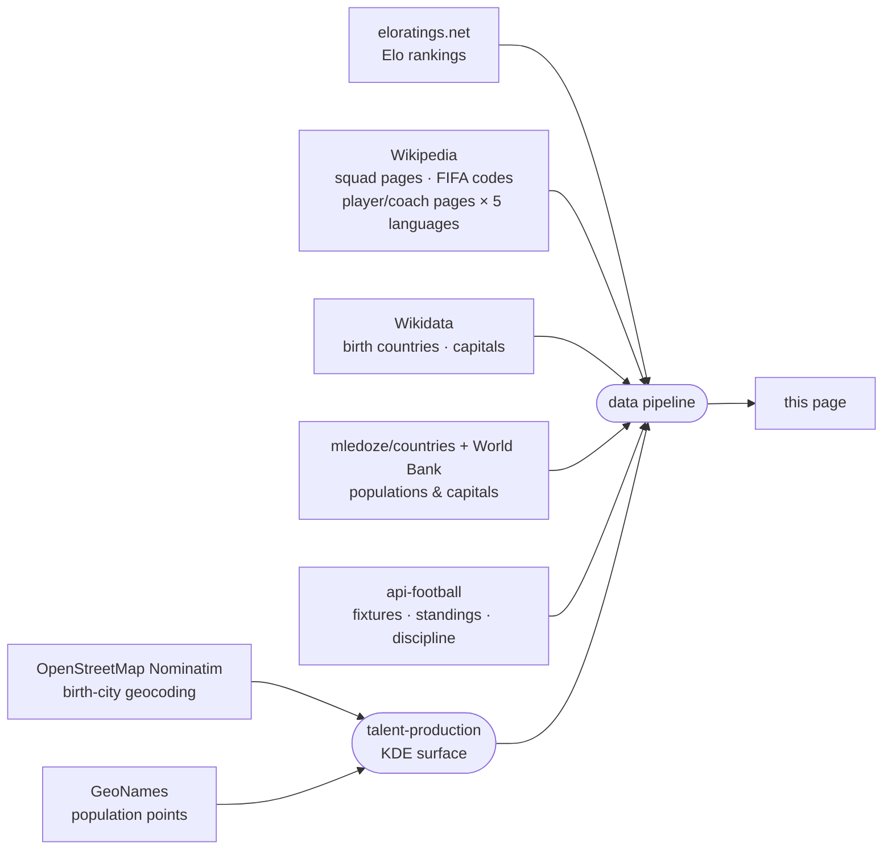

<!-- i18n:data_sources -->
# Data Sources

| Source | Used for |
|---|---|
| [eloratings.net](https://www.eloratings.net/) | World Football Elo rankings |
| [Wikipedia — 2026 World Cup squads](https://en.wikipedia.org/wiki/2026_FIFA_World_Cup_squads) | Player names, cap counts, shirt numbers |
| [Wikipedia API](https://en.wikipedia.org/w/api.php) | Each player's and coach's Wikipedia page resolved in 5 languages (en, fr, de, it, es) |
| [Wikipedia — List of FIFA country codes](https://en.wikipedia.org/wiki/List_of_FIFA_country_codes) | FIFA membership |
| [Wikidata](https://www.wikidata.org/) | Birth countries; multilingual capital-city names |
| [mledoze/countries](https://github.com/mledoze/countries) + [World Bank](https://data.worldbank.org/) | Country populations and capitals |
| [OpenStreetMap Nominatim](https://nominatim.org/) | Birth-city geocoding, for the birthplace map view |
| [GeoNames](https://www.geonames.org/) | Reference population points for the talent-production map layer |
| [api-football](https://www.api-football.com/) | Live fixtures, group standings, match results, discipline (fouls/cards) stats |

**Elo ratings** work like the chess rating system they're named after: every match moves both teams'
scores up or down depending on the result, the goal margin, and how strong the opponent was rated
going in — beating a highly-rated team gains far more than beating a weak one. Unlike the official
FIFA World Ranking, which only updates a handful of times a year, Elo recalculates after each match
and reacts immediately to results, which is why [eloratings.net](https://www.eloratings.net/) is used
as this site's country reference instead of FIFA's own list.

**Birth country resolution** is the most delicate step in the pipeline.
The Wikipedia squad page does not list where players were born — it only provides their names
and links to their individual Wikipedia pages.
The pipeline uses those links as keys to query [Wikidata](https://www.wikidata.org/)
via SPARQL, retrieving each player's recorded place of birth and the country that place belongs to.
This two-step lookup (Wikipedia → Wikidata) is what makes it possible to draw the born-in / plays-for connections on the map.
Wikidata's recorded birthplace is occasionally wrong — pointing at a country or region entity rather
than an actual city, sometimes even a player's national-team country instead of where they were
really born — or missing city-level detail altogether. Cases like these are corrected by hand against
the player's own Wikipedia infobox where one can be found; a very small number of players still ship
with only country-level birth data, or no resolved birthplace at all.

**The talent-production map layer** answers a different question than "where were the most players
born" — a raw density map like that would just track megacity population. Instead it asks "does this
place produce more WC2026 talent than its population would predict?" Two Gaussian surfaces are built
on the same grid: one from geocoded player/coach birth cities, one from a reference population
dataset ([GeoNames](https://www.geonames.org/)), using the same kernel and bandwidth so the two are
directly comparable cell by cell. Dividing one by the other, then normalizing against the tournament's
own global rate, gives a *relative* risk — a value of 1 means "producing talent exactly proportional
to the people who live here," not "producing a lot of talent in absolute terms." That's why a
megacity can register as unremarkable on this map while a small, well-known footballing town lights
up: the layer is deliberately measuring over- and under-performance relative to population, not raw
output. Free-text city geocoding can also occasionally match the wrong place sharing the same name —
caught and corrected through manual review rather than trusted blindly.

**Live standings** use api-football's own group-table ranking rather than one computed from scores
here, so head-to-head record, discipline points, and the rest of FIFA's official tie-break rules are
never at risk of disagreeing with the real classement over an edge case those rules exist for in the
first place.

These sources feed an automated pipeline that merges, cross-references,
and enriches the raw data before publishing it to this page.
Elo ratings and live match data (fixtures, standings, discipline stats) are refreshed as results come
in; squad, birthplace, and talent-production data are updated manually when squads change.
<!-- /i18n:data_sources -->

