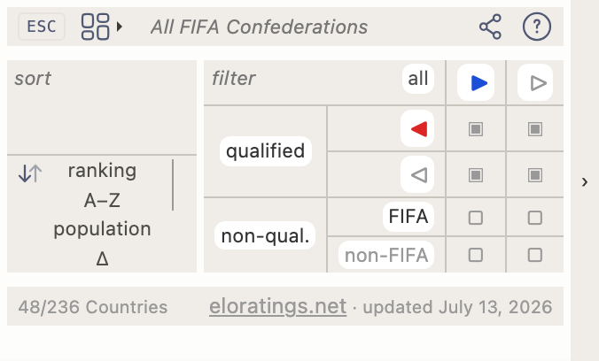
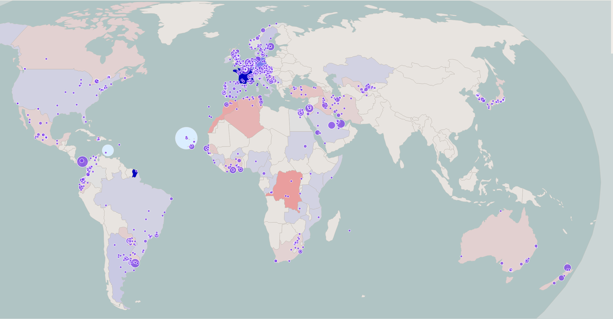
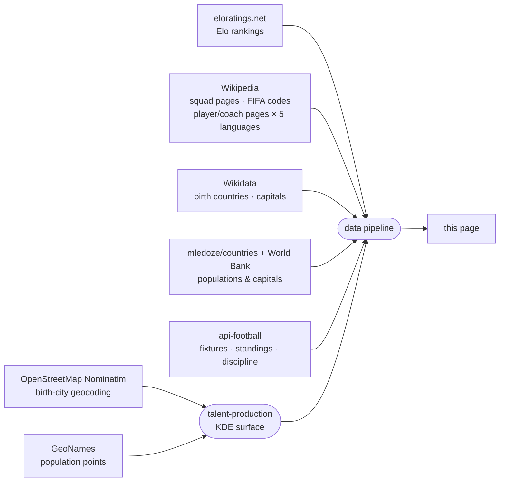

<!-- i18n:page_title -->
# User's Guide
<!-- /i18n:page_title -->

<!-- i18n:intro -->
This map visualises the 2026 FIFA World Cup squads through the lens of birthplace.
Each country is shaded by its net talent balance — see *The Legend*, below —
weighing players born there against players who play there.
<!-- /i18n:intro -->

<!-- i18n:quotes -->
## The Twisted Quotes

The header area shows a rotating carousel of 15 famous literary quotes —
from François Villon (1461) to Simone de Beauvoir (1949) — each playfully
twisted into a football line.

Navigate between quotes using the left-oriented chevrons, or swipe right on touch screens.
Long-press (or hold the mouse button) on a quote to reveal the original line; release to go back.

Swiping left, on the other hand, reveals a different panel entirely — the Control Panel,
covering how countries are filtered, sorted, and displayed.
<!-- /i18n:quotes -->

<!-- i18n:control_sidebar -->
# The Control Panel

The <kbd style="background:var(--bg-hover,#f0ede8);border:1px solid var(--border,#e4e0d8);color:var(--text-muted,#999);border-radius:0 4px 4px 0">‹</kbd> button in the top-right corner of the window opens the control panel,
controlling what appears on the map and in the country list.

The panel has four parts: a **toolbar** across the top; **sort** on the left; the **filter** matrix on the right; and an **infobar** along the bottom.

## Toolbar

- <kbd style="font-size:.68em;font-family:var(--bs-font-monospace,ui-monospace,monospace);background:var(--bg-hover,#f0ede8);border:1px solid var(--border,#e4e0d8);color:#1C274C;border-radius:3px;padding:2px 4px;vertical-align:middle">ESC</kbd> collapses the panel back to its ‹ button.
-  filters the list to a single FIFA confederation — see *FIFA confederation filter*, below.
-  and  form a pair: **share** copies to the clipboard a URL that reproduces the panel's exact current configuration, ready to paste into another device or send to someone else; **params** opens a plain-English summary of those same current settings — sort, filters, stage, and more — the same panel `?explain` opens on any page load (see *URL query parameters*, below).

## Sort

Four reorderable criteria — **Elo ranking** (an independent rating that adjusts after every match based on the result and the opponent's strength — see *Data Sources*, below), **population**, **Δ** (delta of plays-for minus born-in), **A–Z** — plus a direction toggle (↓↑) to reverse ascending/descending. Only the top two criteria are actually used; click a criterion to move it to the top of the list.

## Filter

The matrix crosses two **columns** (exporter / non-exporter) with four **rows** in two groups:

- **Qualified** — split by whether the country imports players or not
- **Non-qualified** — split by FIFA membership

Uncheck any cell to hide that category. Click a row or column header to toggle the whole group at once.

## Infobar

Shows how many countries are currently visible out of the total, and the data source (and last-updated date) for whichever criterion is primary in the sort column.

## FIFA confederation filter

The  button next to the **FIFA** row opens a dropdown to filter the list to a single confederation. Non-FIFA countries are unaffected — they remain visible or hidden according to the rest of the filter matrix.

Selecting a confederation also highlights its external boundary on the map and zooms to fit it in view. Select **All FIFA Confederations** to clear the filter.

## URL query parameters

The filter and sort state can also be configured directly from the URL — `?sort=`, `?dir=`, `?stage=`, `?show=`, `?fifaconf=`. Add `?explain` to any URL to open a panel summarizing the panel's current settings — see *`?explain` — inspect the current configuration* in the [API Guide](?guide=countries) for exactly what it shows and why. The full reference with all cell codes, group aliases and examples is there too.

## About the country reference

The map and the list use [eloratings.net](https://www.eloratings.net/) as the source of countries —
not the FIFA member list. This means the list includes non-FIFA territories such as Greenland,
but also unusual cases like the four UK home nations — sub-national entities
with their own FIFA membership, recognised separately by both FIFA and Elo.
The default sort order is by Elo rating; other sort criteria are available in the sort column.
<!-- /i18n:control_sidebar -->

<!-- i18n:tax_heading -->
## Country Categories
<!-- /i18n:tax_heading -->

<!-- i18n:tax_intro -->
Every country is displayed as a **pill badge** whose CSS style encodes its category at a glance.
<!-- /i18n:tax_intro -->

<!-- i18n:tax_label_qualified -->Qualified vs. non-qualified<!-- /i18n:tax_label_qualified -->

  
    
    Czech Republic
  
  <!-- i18n:tax_desc_border_yes -->Solid border — qualified and still in the tournament.<!-- /i18n:tax_desc_border_yes -->

  
    
    Iran
  
  <!-- i18n:tax_desc_border_dashed -->Dashed border — qualified but knocked out.<!-- /i18n:tax_desc_border_dashed -->

  
    
    Ukraine
  
  <!-- i18n:tax_desc_border_no -->No border — not qualified.<!-- /i18n:tax_desc_border_no -->

<!-- i18n:tax_label_fifa -->FIFA vs. non-FIFA<!-- /i18n:tax_label_fifa -->

  
    
    Iceland
  
  <!-- i18n:tax_desc_text_dark -->Dark text — FIFA member.<!-- /i18n:tax_desc_text_dark -->

  
    
    Greenland
  
  <!-- i18n:tax_desc_text_light -->Light text — not a FIFA member.<!-- /i18n:tax_desc_text_light -->

<!-- i18n:tax_label_born -->Born here / plays for<!-- /i18n:tax_label_born -->

  
    
    Italy
  
  ▶ <!-- i18n:tax_desc_exp -->Players born in this country play for another qualified country.<!-- /i18n:tax_desc_exp -->

  
    
    Curaçao
  
  ◀ <!-- i18n:tax_desc_imp -->Players born in another country play for this country.<!-- /i18n:tax_desc_imp -->

  
    
    France
  
  ◀▶ <!-- i18n:tax_desc_both -->Players born elsewhere play for this country, and players born here play for other countries.<!-- /i18n:tax_desc_both -->

<!-- i18n:tax_note_gradient -->The pill's background is itself a red (imports) → white (native) → blue (exports) gradient — the wider a colour's band, the larger that group's share of the country's total player pool.<!-- /i18n:tax_note_gradient -->

  
    
    France
    3 · 81
  
  <!-- i18n:tax_desc_gradient_exp -->Mostly blue — a heavy exporter (81) with only a handful of imports (3).<!-- /i18n:tax_desc_gradient_exp -->

  
    
    United States
    7 · 11
  
  <!-- i18n:tax_desc_gradient_mixed -->A visible red band alongside the blue — a more even mix of exports (11) and imports (7).<!-- /i18n:tax_desc_gradient_mixed -->

  
    
    Curaçao
    26
  
  <!-- i18n:tax_desc_gradient_imp -->Almost entirely red — nearly the whole squad (26) was born elsewhere.<!-- /i18n:tax_desc_gradient_imp -->

<!-- i18n:tax_label_offmap -->Off the map<!-- /i18n:tax_label_offmap -->

<!-- i18n:tax_note_offmap -->Orthogonal to the categories above.<!-- /i18n:tax_note_offmap -->

  
    
    Singapore
  
  <!-- i18n:tax_desc_nomap -->Dimmed flag — not present in the map's underlying geographic data (typically because the territory is too small).<!-- /i18n:tax_desc_nomap -->

  
    
    Monaco
  
  <!-- i18n:tax_desc_nomap_nonfifa -->Same, here combined with non-FIFA.<!-- /i18n:tax_desc_nomap_nonfifa -->

<!-- i18n:tax_label_fixture -->Fixtures (match view)<!-- /i18n:tax_label_fixture -->

<!-- i18n:tax_note_fixture -->Only shown once countries are grouped by fixture — see *Tournament*, below.<!-- /i18n:tax_note_fixture -->

  
    
      
        
        Morocco
      
    
  
  <!-- i18n:tax_desc_won -->Green check on the pill — won a decided fixture.<!-- /i18n:tax_desc_won -->

  
    
    Brazil
  
  <!-- i18n:tax_desc_lost -->Grayed flag — lost a decided fixture.<!-- /i18n:tax_desc_lost -->

  
    
      
      Germany
    
  
  <!-- i18n:tax_desc_pending -->Wavy border — fixture not yet played.<!-- /i18n:tax_desc_pending -->

<!-- i18n:map -->
# The Map

## Choropleth & Flags

Each country is shaded by its net talent balance — home-grown contribution (exports plus native-born players) minus imports (see *The Legend*, below). The more one-sided that balance, in either direction, the darker the shade; a country close to a neutral balance appears pale. Countries with no data for that metric appear in a neutral pale tone.
Countries currently included in the filter display a circular flag marker.

## Zoom & Pan

Scroll (or pinch) to zoom · drag to pan. Two round buttons sit in the bar below the map, at the left of the legend:

-  zooms back out to the default view — every country the map actually shows, fit into frame. A handful of small territories have no map presence at all and are never included; see *Off the map*, above.
-  zooms and pans to fit whatever's currently visible on the map — every shown flag by default, or just the highlighted set while a country is selected (or a group-stage focus is active).

## The Legend

The map shades every country by its net talent balance — home-grown contribution (exports plus native-born players) minus imports. Net exporters and net importers read as two different colours either side of a neutral midpoint.

The colour bar at the bottom of the header reads left to right like a number line — negative extreme, neutral 0 in the middle, positive extreme — with a reference tick at each end and midpoint, and a standalone dot *at each end* for the country furthest off scale on that side (biggest net importer, biggest net exporter).

## Tooltips

Hover any country to see details. Tooltips are not shown on mobile.

- **Birth countries**: export count and top players, each with their destination flag
- **Qualified countries that also recruit**: a right-hand column adds the import side
- **Non-qualified birth countries**: a *not qualified* badge replaces the squad panel
<!-- /i18n:map -->

<!-- i18n:bottom_panel -->
# The Bottom Panel

The scrollable area below the map has three tabs.

##  The Country List

The default tab lists every country — qualified or not — as a pill badge, no tournament carousel.
The Control Panel controls which badges appear and in what order;
the default sort is by [World Football Elo rating](https://www.eloratings.net/).

Clicking a badge selects that country and zooms the map to it.

For countries with **born-in / plays-for** connections, coloured arrows also appear on the map:

- {{ARROW_BLUE}} **blue arrows**: squads that include players born in the selected country
- {{ARROW_RED}} **red arrows**: countries where players born elsewhere play for this squad

*Arrow thickness scales with the number of players.*

The zoom buttons described in *Zoom & Pan*, above, behave the same way here: **span** now fits the highlighted countries specifically, **reset** returns to the default view.

Click the active badge a second time, click anywhere else on the map, or press **Esc** to deselect.

##  Tournament

The same badge list, this time scoped to the 48 **qualified** countries only, with a small carousel above it cycling through seven positions: **Group stage → Round of 32 → Round of 16 → Quarter-finals → Semi-finals → Final → Winner**.

- Use the ‹ › arrows, or swipe left/right on touch screens, to move between stages.
- Each position filters qualified countries down to those that "reached" that stage — still alive going into it, or having already won it.
- Navigation is capped at the furthest stage the tournament has actually reached; later positions stay locked until real fixtures resolve into them.

The carousel acts as an additional filter, layered on top of the Control Panel — you can, for example,
show only Round of 16 teams that are also exporters by advancing the carousel and unchecking the non-exporter column in the panel.
It only filters the four **qualified** rows (importer / non-importer × exporter / non-exporter); the four **non-qualified** rows have no tournament stage of their own to reach.

At **Group stage**, the badge list is replaced by group standings — all 12 groups (A–L) at once by default, or narrowed to one at a time via the selector, with each match's result and the teams through to the Round of 32 highlighted based on the actual outcomes (a draw earns no checkmark either way).

Past Group stage, countries are instead grouped by fixture automatically: each row pairs both opponents either side of the kickoff date/score —

- Not yet played: the kickoff date, and a wavy top/bottom border on both pills — a "some assembly required" look for a fixture that could still go either way.
- Played: the score (plus penalty shootout result, if it went that far) in place of the date, and the losing team's flag greyed out.

At the **Final** position, the two Semi-finals losers get their own pairing — the 3rd Place Final — in a separate, headed list below the real Final, so the two matches are never mixed together.

Clicking a badge, arrows, and the zoom buttons all behave the same way here as in *The Country List*, above.

##  The Player Table

Always the same flat table — **name**, **born-in**, **plays-for**, **caps** — no matter what's selected. Click a column header to sort by it; click again to reverse the order. Player names link to their Wikipedia page in the current interface language when available.

Only the rows change with the current selection:

- **Nothing selected**: every player and coach on all 48 qualified squads currently visible on the map.
- **One country selected**: every player and coach tied to it — born there, born and selected there, or born elsewhere and selected there.
- **A fixture selected**: both teams' players combined.

With nothing selected, birth cities are also plotted on the map itself as bubbles — one dot per unique birth city among the listed players, bigger where more players share a city:

Hover a dot for the city name and player count.

##  Chains

Sequences of countries linked by born-in / plays-for connections — a player born in A plays for B, a player born in B plays for C, and so on, forming a chain of nationalities across the tournament — are explored on their own [standalone page](/chains/wc2026_chain_longest.html).
<!-- /i18n:bottom_panel -->

<!-- i18n:data_sources -->
# Data Sources

| Source | Used for |
|---|---|
| [eloratings.net](https://www.eloratings.net/) | World Football Elo rankings |
| [Wikipedia — 2026 World Cup squads](https://en.wikipedia.org/wiki/2026_FIFA_World_Cup_squads) | Player names, cap counts, shirt numbers |
| [Wikipedia API](https://en.wikipedia.org/w/api.php) | Each player's and coach's Wikipedia page resolved in 5 languages (en, fr, de, it, es) |
| [Wikipedia — List of FIFA country codes](https://en.wikipedia.org/wiki/List_of_FIFA_country_codes) | FIFA membership |
| [Wikidata](https://www.wikidata.org/) | Birth countries; multilingual capital-city names |
| [mledoze/countries](https://github.com/mledoze/countries) + [World Bank](https://data.worldbank.org/) | Country populations and capitals |
| [OpenStreetMap Nominatim](https://nominatim.org/) | Birth-city geocoding, for the birthplace map view |
| [GeoNames](https://www.geonames.org/) | Reference population points for the talent-production map layer |
| [api-football](https://www.api-football.com/) | Live fixtures, group standings, match results, discipline (fouls/cards) stats |

**Elo ratings** work like the chess rating system they're named after: every match moves both teams'
scores up or down depending on the result, the goal margin, and how strong the opponent was rated
going in — beating a highly-rated team gains far more than beating a weak one. Unlike the official
FIFA World Ranking, which only updates a handful of times a year, Elo recalculates after each match
and reacts immediately to results, which is why [eloratings.net](https://www.eloratings.net/) is used
as this site's country reference instead of FIFA's own list.

**Birth country resolution** is the most delicate step in the pipeline.
The Wikipedia squad page does not list where players were born — it only provides their names
and links to their individual Wikipedia pages.
The pipeline uses those links as keys to query [Wikidata](https://www.wikidata.org/)
via SPARQL, retrieving each player's recorded place of birth and the country that place belongs to.
This two-step lookup (Wikipedia → Wikidata) is what makes it possible to draw the born-in / plays-for connections on the map.

**The talent-production map layer** answers a different question than "where were the most players
born" — a raw density map like that would just track megacity population. Instead it asks "does this
place produce more WC2026 talent than its population would predict?" Two Gaussian surfaces are built
on the same grid: one from geocoded player/coach birth cities, one from a reference population
dataset ([GeoNames](https://www.geonames.org/)), using the same kernel and bandwidth so the two are
directly comparable cell by cell. Dividing one by the other, then normalizing against the tournament's
own global rate, gives a *relative* risk — a value of 1 means "producing talent exactly proportional
to the people who live here," not "producing a lot of talent in absolute terms." That's why a
megacity can register as unremarkable on this map while a small, well-known footballing town lights
up: the layer is deliberately measuring over- and under-performance relative to population, not raw
output.

**Live standings** use api-football's own group-table ranking rather than one computed from scores
here, so head-to-head record, discipline points, and the rest of FIFA's official tie-break rules are
never at risk of disagreeing with the real classement over an edge case those rules exist for in the
first place.

These sources feed an automated pipeline that merges, cross-references,
and enriches the raw data before publishing it to this page.
Elo ratings and live match data (fixtures, standings, discipline stats) are refreshed as results come
in; squad, birthplace, and talent-production data are updated manually when squads change.
<!-- /i18n:data_sources -->

